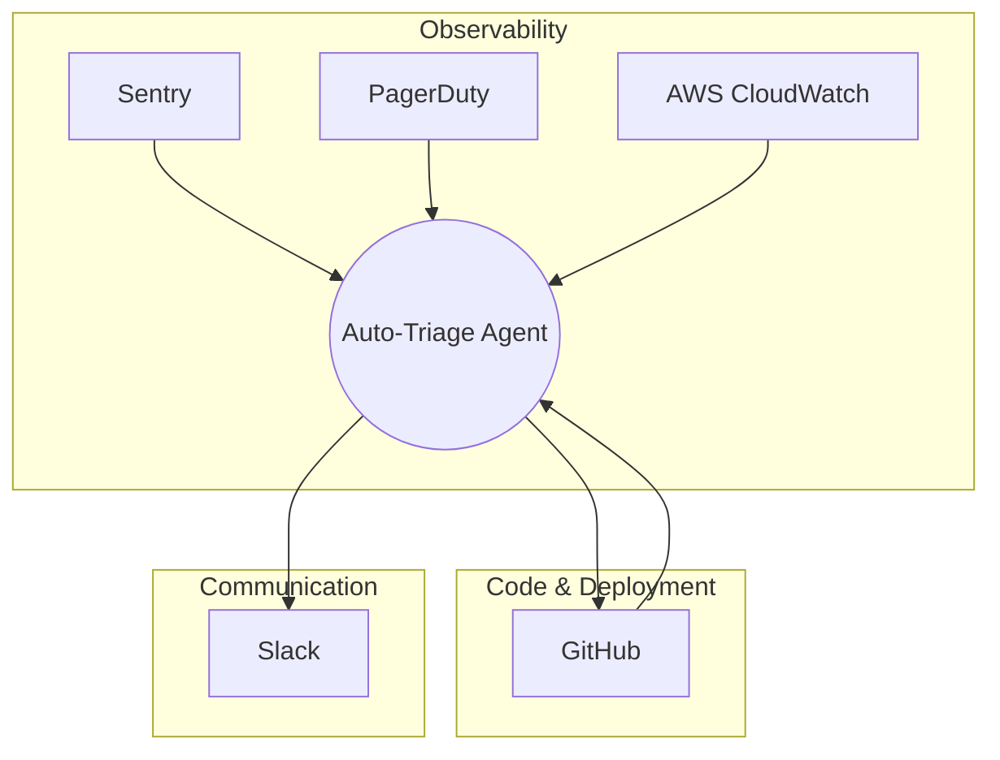
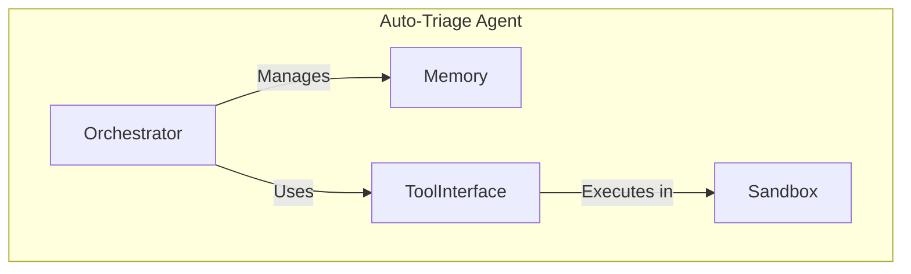
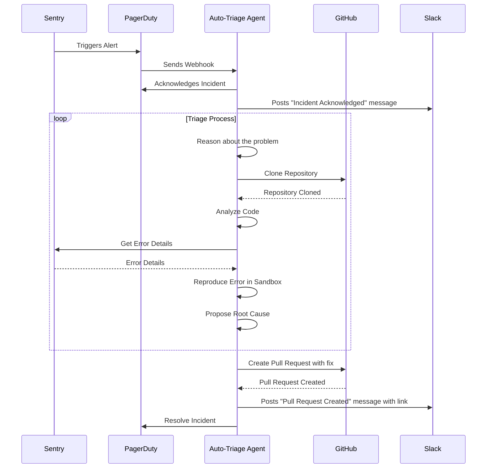
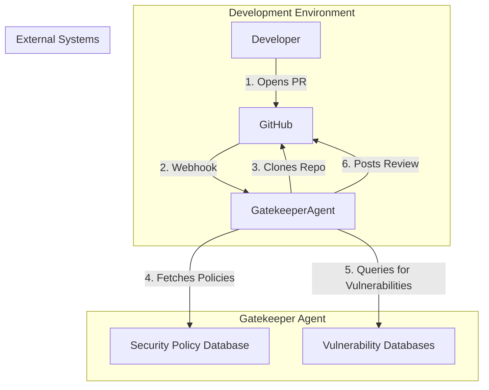
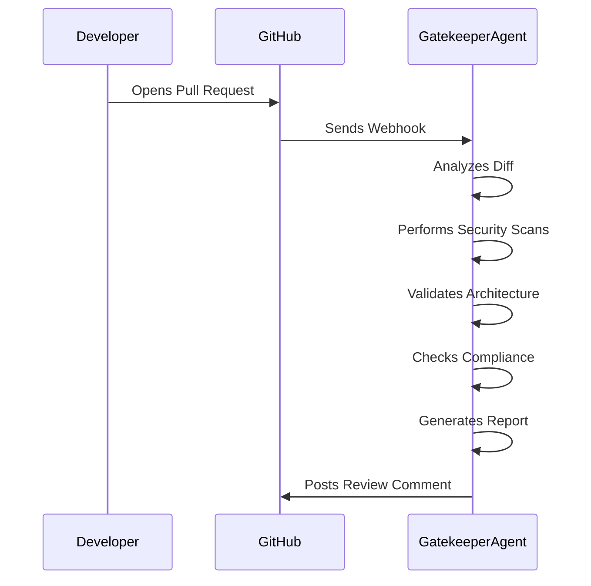
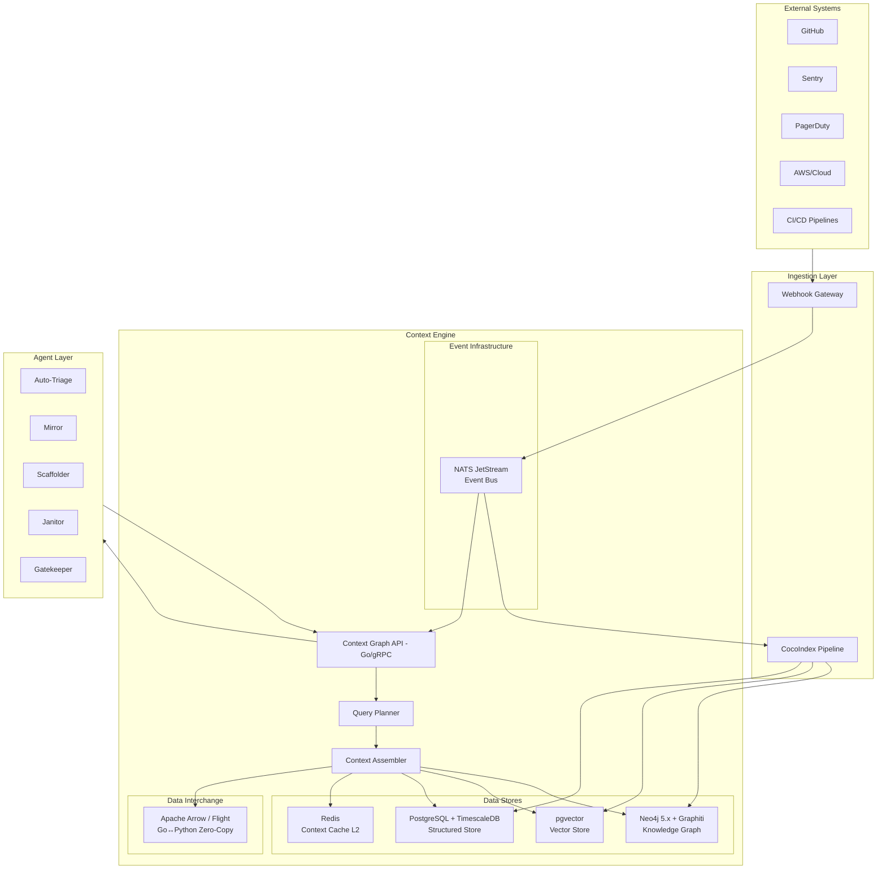
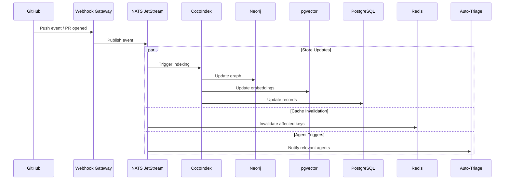
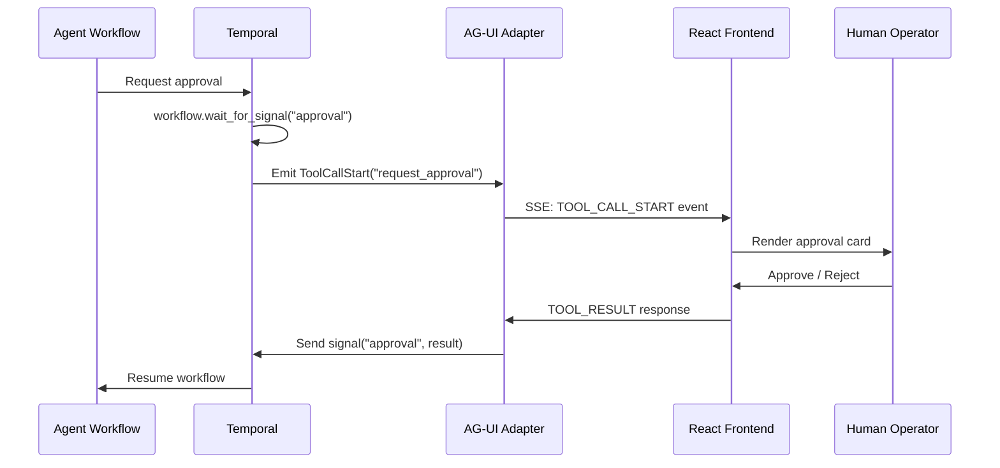

# Agentic DevOps & DevEx Architecture for Abnormal.AI

## Executive Summary

This document presents a technical architectural dossier detailing five production-ready agentic systems designed to eliminate key bottlenecks in the "Plan → Code → Test" lifecycle for a Python/Go/Cloud-native engineering organization like Abnormal.AI. Moving beyond simple "chatbots," these autonomous, loop-based agents function as an "Operating System" for engineering, directly addressing the challenges of context integration, deterministic validation, and safe execution. The proposed systems—Auto-Triage, Mirror (Test Gen), Scaffolder, Janitor (Refactoring), and Gatekeeper (CI Review)—are designed to enhance developer velocity and satisfaction while satisfying stringent security and compliance requirements. This report provides a detailed Arc42-style architectural analysis for each agent, a technology stack recommendation, and a critical assessment of risks and mitigation strategies.

# Pain Point & Opportunity Analysis in Cybersecurity Startup DevOps

## 1. Introduction: The Unique Challenges of Cybersecurity DevOps

In the high-stakes world of cybersecurity, startups face a unique and intense set of challenges. They operate in a constantly evolving threat landscape, where the consequences of a single vulnerability can be catastrophic. This unforgiving environment places immense pressure on their DevOps teams, who are tasked with the dual mandate of delivering innovative features at a rapid pace while maintaining the highest standards of security and reliability. The traditional software development lifecycle, often summarized as the 'Plan to Code to Test' loop, is stretched to its limits in this context. The need for speed, driven by competitive market pressures, often clashes with the meticulous and time-consuming nature of security best practices. This inherent tension creates a fertile ground for friction, bottlenecks, and ultimately, developer burnout.

This report delves into the specific pain points and opportunities within the DevOps lifecycle of high-growth cybersecurity startups. We will analyze the top five areas where human friction is most acute, from the complexities of integration testing to the thankless task of updating legacy documentation. We will also quantify the impact of these challenges on developer productivity, examining the hidden costs of context switching and inefficient CI/CD pipelines. By studying how established cybersecurity leaders like CrowdStrike, SentinelOne, and Palo Alto Networks have tackled these issues, we can identify best practices and emerging trends in internal developer experience. Finally, we will explore the transformative potential of AI-native solutions to alleviate these pain points and create a more resilient, efficient, and secure DevOps ecosystem.

## 2. The Top 5 Areas of Human Friction in the Development Lifecycle

The 'Plan to Code to Test' loop in a cybersecurity startup is a minefield of potential delays and frustrations. While every stage of the process has its challenges, our research has identified five key areas where human friction is most pronounced:

### 2.1. The Burden of Integration Testing for Security-Critical Systems

Writing and maintaining integration tests is a critical but often arduous task, especially for security-critical systems. In a microservices architecture, where services are constantly evolving and interacting in complex ways, ensuring that changes in one service don't have unintended security consequences in another is a monumental undertaking. Developers must not only write tests that cover the functional aspects of their code but also consider a wide range of potential attack vectors and security vulnerabilities. This requires a deep understanding of both the application's business logic and the intricacies of modern security threats. The sheer volume and complexity of these tests can be overwhelming, leading to shortcuts, incomplete test coverage, and a false sense of security.

### 2.2. Alert Fatigue: Triaging Production Alerts and Sentry Errors

Production environments in cybersecurity startups are a constant source of alerts, from infrastructure monitoring tools to application performance monitoring (APM) platforms like Sentry. While these alerts are essential for identifying and responding to potential issues, the sheer volume of them can be overwhelming. Developers are often inundated with a flood of notifications, many of which turn out to be false positives or low-priority issues. This 'alert fatigue' can lead to a desensitization to alerts, making it more likely that a critical issue will be missed. The process of triaging these alerts is also a significant time sink. Developers must context-switch from their primary tasks to investigate the alert, determine its root cause, and decide on the appropriate course of action. This constant interruption can have a major impact on productivity and morale.

### 2.3. The Vicious Cycle of Legacy Documentation

Documentation is often the first casualty of a fast-paced development environment. In the race to ship new features, updating documentation is often seen as a low-priority task. This leads to a vicious cycle of outdated and inaccurate documentation, which in turn makes it more difficult for new developers to onboard, for existing developers to understand the system, and for security teams to assess the organization's security posture. The lack of clear and up-to-date documentation can also lead to costly mistakes, as developers may make incorrect assumptions about how a system is supposed to work. The effort required to update legacy documentation can be substantial, especially for complex systems that have evolved over time. This creates a significant barrier to improving the situation, as developers are often reluctant to take on the thankless task of overhauling the documentation.

### 2.4. Scaffolding New Microservices with Security Baselines

The process of scaffolding a new microservice should be a straightforward and efficient process. However, in a cybersecurity startup, it's fraught with potential pitfalls. Every new service must be built with a strong security foundation, which includes a wide range of security controls, from authentication and authorization to logging and monitoring. The process of implementing these security baselines can be time-consuming and error-prone, especially if it's done manually. Developers must be familiar with the organization's security policies and standards, and they must ensure that the new service is configured correctly to meet those requirements. The lack of a standardized and automated process for scaffolding new services can lead to inconsistencies in the organization's security posture, making it more difficult to manage and secure the overall system.

### 2.5. The High Stakes of Database Migrations

Database migrations are a high-stakes operation in any organization, but they are especially so in a cybersecurity startup. A failed or flawed migration can lead to data loss, data corruption, or a security breach. The process of verifying the safety of a database migration is a complex and time-consuming task. Developers must carefully review the migration script, test it in a staging environment, and monitor the production environment closely after the migration is complete. The lack of automated tools for verifying the safety of database migrations can make this process even more challenging. Developers must often rely on manual checks and their own judgment to ensure that the migration is safe. This creates a significant risk of human error, which can have serious consequences.

## 3. Developer Productivity Under Siege: Quantifying the Cost of Inefficiency

The friction points described above have a direct and measurable impact on developer productivity. The time that developers spend on these non-coding tasks is time that they could be spending on building new features and improving the product. The constant interruptions and context switching also take a toll on their cognitive energy, making it more difficult for them to focus on their primary tasks.

### 3.1. The Tax of Context Switching

Context switching is a major productivity killer for developers. Every time a developer is interrupted, it takes them an average of 23 minutes and 15 seconds to get back to their original task. [1] This means that even a few interruptions a day can add up to a significant amount of lost time. In a cybersecurity startup, where developers are constantly being pulled in different directions, the cost of context switching can be substantial. Based on an average developer salary, the cost of context switching can be as high as $250 per developer per day. [1]

### 3.2. CI/CD Pipeline Bottlenecks

A slow and inefficient CI/CD pipeline can be a major source of frustration for developers. Long build and test times can bring the development process to a grinding halt, forcing developers to wait for feedback on their changes. This can lead to a loss of momentum and a decrease in productivity. A recent survey found that developers spend an average of 57 minutes a day waiting for builds to finish. [1] This wasted time can have a significant impact on the overall velocity of the development team.

### 3.3. The Hidden Cost of "Security Theatre"

While security is of paramount importance in a cybersecurity startup, it's important to ensure that security processes are not just 'security theatre'. Security processes that are overly burdensome and do not provide a real security benefit can be a major source of frustration for developers. For example, a lengthy and manual security review process can slow down the development process without providing a significant improvement in security. It's important to strike the right balance between security and developer productivity. Security processes should be automated as much as possible, and they should be designed to be as frictionless as possible for developers.

## 4. Lessons from the Leaders: Internal Developer Experience at Scale

Established cybersecurity leaders like CrowdStrike, SentinelOne, and Palo Alto Networks have invested heavily in their internal developer experience. They recognize that a happy and productive engineering team is a major competitive advantage. By studying how these companies have tackled the challenges of DevOps at scale, we can identify best practices and emerging trends in internal developer experience.

### 4.1. CrowdStrike: Investing in a Frictionless Developer Platform

CrowdStrike has a strong focus on providing its developers with a frictionless developer platform. They have invested in building a suite of internal tools and services that automate many of the tedious and time-consuming tasks that developers have to perform. For example, they have a standardized process for scaffolding new services, which includes all of the necessary security baselines. They also have a sophisticated CI/CD pipeline that is designed to be as fast and efficient as possible. By investing in their internal developer platform, CrowdStrike has been able to improve developer productivity and reduce the time it takes to ship new features.

### 4.2. SentinelOne: A Focus on Data-Driven Engineering

SentinelOne has a strong culture of data-driven engineering. They use metrics to track everything from developer productivity to the performance of their CI/CD pipeline. This allows them to identify bottlenecks and areas for improvement. For example, they use data to identify the root causes of slow build times, and they use this information to make targeted improvements to their CI/CD pipeline. By using data to drive their engineering decisions, SentinelOne has been able to create a more efficient and effective DevOps process.

### 4.3. Palo Alto Networks: Building a Culture of "Paved Roads"

Palo Alto Networks has a concept of 'paved roads', which are well-supported paths for developers to follow. These paved roads provide developers with a set of pre-approved tools and services that they can use to build and deploy their applications. This helps to ensure that all applications are built to the same high standards of security and reliability. The paved roads also make it easier for developers to get their work done, as they don't have to spend time researching and evaluating different tools and services. By providing developers with a set of paved roads, Palo Alto Networks has been able to improve developer productivity and reduce the risk of security vulnerabilities.

## 5. The Path Forward: AI-Native Solutions for a More Resilient DevOps

The challenges of DevOps in a cybersecurity startup are significant, but they are not insurmountable. The rise of AI-native solutions presents a major opportunity to alleviate these pain points and create a more resilient, efficient, and secure DevOps ecosystem.

### 5.1. The Rise of Agentic DevOps

Agentic DevOps is a new paradigm in which AI agents are used to automate and augment the development lifecycle. These agents can be used to perform a wide range of tasks, from writing code to triaging alerts. For example, an AI agent could be used to automatically generate integration tests for a new service, or it could be used to automatically triage production alerts and escalate only the most critical issues to developers. By automating these tedious and time-consuming tasks, AI agents can free up developers to focus on more creative and strategic work.

### 5.2. Opportunities for AI Intervention in the Top 5 Pain Points

AI can be used to address each of the top five pain points in the development lifecycle:

*   **Integration Testing:** AI can be used to automatically generate integration tests, identify security vulnerabilities, and provide developers with feedback on their code.
*   **Alert Triaging:** AI can be used to automatically triage production alerts, filter out false positives, and escalate only the most critical issues to developers.
*   **Legacy Documentation:** AI can be used to automatically generate documentation from code, identify outdated documentation, and provide developers with a summary of the changes that have been made to a system.
*   **Scaffolding New Microservices:** AI can be used to automatically scaffold new microservices with all of the necessary security baselines.
*   **Database Migrations:** AI can be used to automatically verify the safety of database migrations, identify potential issues, and provide developers with a summary of the changes that will be made to the database.

### 5.3. The Future of the "Plan to Code to Test" Loop

The future of the 'Plan to Code to Test' loop is one in which AI plays a central role. AI will be used to automate many of the tedious and time-consuming tasks that developers have to perform, freeing them up to focus on more creative and strategic work. This will lead to a more efficient, effective, and secure DevOps process. The 'Plan to Code to Test' loop will become a more seamless and integrated process, with AI agents working alongside developers to build and deploy high-quality software at a rapid pace.

## 6. Conclusion: From Pain Points to Competitive Advantage

The pain points of DevOps in a cybersecurity startup are significant, but they also present a major opportunity. By addressing these pain points, startups can create a more efficient, effective, and secure DevOps process. This will not only improve developer productivity and morale, but it will also give them a major competitive advantage. The startups that are able to master the art of DevOps will be the ones that are able to innovate at a rapid pace while maintaining the highest standards of security and reliability. The rise of AI-native solutions presents a major opportunity to accelerate this transformation. By embracing AI, cybersecurity startups can create a more resilient, efficient, and secure DevOps ecosystem, and position themselves for long-term success.

## References

[1] [How Much Does Context-Switching Cost Your Dev Team?](https://www.incredibuild.com/blog/how-much-does-context-switching-cost-your-dev-team)


# Auto-Triage Agent Architecture: A Pragmatic Approach to Production Reliability

## 1. Introduction

The relentless pace of software development and the increasing complexity of modern production environments have made effective incident management a critical component of site reliability engineering (SRE). The traditional model of human-on-call engineers responding to a barrage of alerts is becoming increasingly unsustainable. The sheer volume of alerts, coupled with the cognitive load of diagnosing and resolving complex issues, leads to burnout, slower response times, and ultimately, a negative impact on system reliability and customer experience. The industry is at an inflection point, where the integration of artificial intelligence, specifically Large Language Models (LLMs), into the incident response lifecycle is no longer a novelty but a necessity.

This document outlines a pragmatic architectural vision for an **Auto-Triage Agent**, an AI-native system designed to autonomously handle production incidents. This is not a theoretical exploration of what might be possible, but a production-focused blueprint for building a reliable, efficient, and trustworthy AI agent that can function as a valuable member of an SRE team. We will eschew marketing hype and focus on the systems design principles—latency, consistency, and fault tolerance—that are essential for building a system that can be trusted to operate in a production environment.

Our proposed agent is designed to perform the following key functions:

*   **Detect production errors:** Ingest and analyze alerts from various monitoring systems.
*   **Read logs and metrics:** Gather context from observability platforms to understand the scope and impact of an issue.
*   **Clone repositories:** Access the relevant source code to understand the application logic.
*   **Reproduce errors locally:** Safely execute code in a sandboxed environment to validate the issue and test potential fixes.
*   **Propose root cause analysis:** Leverage its reasoning capabilities to identify the underlying cause of the problem.
*   **Draft pull requests for fixes:** Generate code changes to address the issue and create a pull request for human review.

To ground our architectural discussion in a structured and comprehensive framework, we will leverage the **Arc42** methodology. This will allow us to systematically explore the agent's architecture from multiple perspectives, ensuring that we cover all critical aspects of its design and implementation. We will examine the agent's **Context View**, detailing its interactions with external systems; its **Building Block View**, breaking down its internal components; its **Runtime View**, illustrating its behavior during a triage operation; and its **Cross-cutting Concepts**, addressing critical concerns such as security, safety, and cost management.

This document is intended for principal staff engineers, AI-native architects, and SRE leaders who are looking to move beyond the hype and build a practical, production-ready auto-triage agent. Our focus will be on concrete technologies, established patterns, and real-world implementation details, drawing on the experiences of companies like PagerDuty, Datadog, and Rootly, as well as established AI research patterns like ReAct.

## 2. Context View

The Auto-Triage Agent does not operate in a vacuum. It is a component of a larger ecosystem of development and operations tools. Its effectiveness is directly dependent on its ability to seamlessly integrate with these external systems. The following diagram illustrates the agent's context, showing the key systems it interacts with and the flow of information between them.



### 2.1. Integrations

The agent's ability to gather information and take action is entirely dependent on its integrations with external systems. These integrations are not simply about API calls; they are about understanding the semantics of the data provided by each system and the capabilities that each system exposes.

#### 2.1.1. Alerting and Monitoring (Sentry, PagerDuty, AWS CloudWatch)

The agent's workflow begins with an alert. It must be able to ingest alerts from a variety of sources, including:

*   **Sentry:** For application error monitoring. The agent will need to be able to parse Sentry's alert format, extract key information such as the stack trace, error message, and relevant tags, and use the Sentry API to gather additional context about the issue.
*   **PagerDuty:** As a central hub for incident management, PagerDuty is a critical integration point. The agent will need to be able to receive PagerDuty webhooks, acknowledge incidents, and use the PagerDuty API to update incident status and add notes.
*   **AWS CloudWatch:** For infrastructure and application metrics. The agent will need to be able to query CloudWatch Logs and Metrics to gather data on system performance, resource utilization, and other relevant indicators.

#### 2.1.2. Code Repository (GitHub)

To understand the application logic and propose fixes, the agent needs access to the source code. The integration with GitHub will allow the agent to:

*   **Clone repositories:** To get a local copy of the code.
*   **Read files:** To analyze the code and identify potential areas of concern.
*   **Create branches:** To work on a fix without affecting the main branch.
*   **Commit changes:** To save the proposed fix.
*   **Create pull requests:** To submit the fix for human review.

#### 2.1.3. Communication (Slack)

While the agent is designed to be autonomous, it is not a black box. It needs to be able to communicate with the on-call engineers, providing updates on its progress and asking for help when it gets stuck. The integration with Slack will allow the agent to:

*   **Post messages to incident channels:** To keep the team informed of its activities.
*   **Receive commands from engineers:** To allow for human intervention and control.
*   **Present its findings and proposed fixes:** To facilitate human review and approval.


## 3. Building Block View

The Auto-Triage Agent is a complex system composed of several interacting components. This section details the key building blocks of the agent, explaining their responsibilities and how they work together to achieve the agent's goals.



### 3.1. Orchestrator

The **Orchestrator** is the brain of the Auto-Triage Agent. It is responsible for managing the overall triage process, from receiving the initial alert to proposing a fix. The Orchestrator is implemented as a ReAct-style agent, meaning it interleaves reasoning and acting to solve problems.

**Responsibilities:**

*   **State Management:** The Orchestrator maintains the state of the triage process, including the current hypothesis, the actions taken, and the observations gathered.
*   **Reasoning:** The Orchestrator uses an LLM to reason about the problem, formulate hypotheses, and decide on the next course of action.
*   **Planning:** The Orchestrator creates and updates a plan for resolving the incident. This plan is not static; it is continuously revised based on new information.
*   **Tool Selection:** The Orchestrator decides which tool to use to gather information or take action. For example, it might decide to use the GitHub tool to read a file or the Shell tool to run a command.

### 3.2. Memory

The **Memory** component is responsible for storing and retrieving information needed by the Orchestrator. This is not just a simple key-value store; it is a structured repository of information that the agent has gathered about the incident.

**Responsibilities:**

*   **Short-term Memory:** Stores the immediate context of the triage process, such as the current alert, the most recent actions, and the latest observations. This is analogous to the context window of an LLM.
*   **Long-term Memory:** Stores information that needs to be persisted across multiple triage sessions, such as historical incident data, architectural diagrams, and team runbooks. This allows the agent to learn from past experiences and improve its performance over time.
*   **Vector Database:** A vector database is used to store and retrieve information based on semantic similarity. This is particularly useful for finding relevant information in long documents or chat histories.

### 3.3. Tool Interface

The **Tool Interface** is the agent's connection to the outside world. It provides a standardized way for the Orchestrator to interact with external systems, such as GitHub, Sentry, and AWS.

**Responsibilities:**

*   **Tool Abstraction:** The Tool Interface abstracts the details of each tool's API, providing a simple, consistent interface for the Orchestrator to use.
*   **Tool Execution:** The Tool Interface is responsible for executing the tools selected by the Orchestrator and returning the results.
*   **Error Handling:** The Tool Interface handles errors that may occur during tool execution, such as API failures or network timeouts.

### 3.4. Sandbox

The **Sandbox** is a secure, isolated environment where the agent can execute code. This is a critical safety feature that prevents the agent from causing unintended damage to the production environment.

**Responsibilities:**

*   **Code Execution:** The Sandbox provides a runtime environment for executing code, such as Python scripts or shell commands.
*   **Isolation:** The Sandbox is isolated from the host system and the production network, preventing the agent from accessing sensitive data or making unauthorized changes.
*   **Resource Limits:** The Sandbox enforces resource limits on CPU, memory, and network usage to prevent the agent from consuming excessive resources.
*   **Monitoring:** The Sandbox monitors the code being executed for any malicious or dangerous behavior.


## 4. Runtime View

The Runtime View describes how the Auto-Triage Agent behaves during a typical incident response scenario. The following sequence diagram illustrates the flow of control and information between the agent's building blocks and the external systems it interacts with.



### 4.1. Triage Workflow

The triage process is an iterative loop of reasoning and acting, guided by the ReAct pattern. The following steps outline a typical workflow:

1.  **Incident Ingestion:** The agent receives an alert from PagerDuty, which was triggered by an error in Sentry.
2.  **Acknowledgement:** The agent acknowledges the incident in PagerDuty and posts a message to the relevant Slack channel.
3.  **Information Gathering:** The agent begins to gather information about the incident. It clones the relevant repository from GitHub, reads the Sentry error details, and queries CloudWatch for relevant metrics and logs.
4.  **Hypothesis Formulation:** Based on the initial information, the agent formulates a hypothesis about the root cause of the problem.
5.  **Hypothesis Testing:** The agent tests its hypothesis by attempting to reproduce the error in a sandboxed environment. This may involve running a subset of the application code or executing a specific test case.
6.  **Reasoning and Iteration:** If the hypothesis is confirmed, the agent proceeds to the next step. If not, it revisits its reasoning, gathers more information, and formulates a new hypothesis. This loop continues until the agent has identified the root cause of the problem.
7.  **Fix Generation:** Once the root cause is identified, the agent generates a fix for the problem. This may involve writing new code, modifying existing code, or rolling back a recent change.
8.  **Pull Request Creation:** The agent creates a new branch in GitHub, commits the fix, and creates a pull request for human review.
9.  **Resolution:** The agent posts a message to Slack with a link to the pull request and resolves the incident in PagerDuty.

## 5. Cross-cutting Concepts

There are several cross-cutting concerns that must be addressed in the design and implementation of the Auto-Triage Agent. These are not specific to any single building block, but rather apply to the system as a whole.

### 5.1. Safety and Security

Safety and security are paramount for an agent that operates in a production environment. The following measures are essential to ensure that the agent does not cause unintended harm:

*   **Sandboxed Execution:** All code execution must take place in a secure, isolated sandbox.
*   **Read-only Access:** The agent should have read-only access to production systems by default. Any write access should be granted on a case-by-case basis and with human approval.
*   **Human-in-the-Loop:** The agent should not be allowed to deploy changes to production without human review and approval.
*   **Rate Limiting:** The agent's interactions with external systems should be rate-limited to prevent it from overwhelming them.

### 5.2. Cost Management

The use of LLMs can be expensive, so it is important to have a strategy for managing costs.

*   **Model Selection:** Use the most cost-effective model that can perform the task. For example, a smaller, faster model might be sufficient for simple tasks, while a larger, more powerful model might be needed for complex reasoning.
*   **Caching:** Cache the results of expensive operations, such as LLM calls and API requests.
*   **Token Limits:** Set limits on the number of tokens that the agent can consume in a single triage session.

### 5.3. State Management

Managing the state of a long-running, asynchronous process like incident triage is a complex problem. The agent needs to be able to maintain its state across multiple interactions and be resilient to failures.

*   **Persistent Storage:** The agent's state should be stored in a persistent database, such as PostgreSQL or Redis.
*   **Stateful Workflows:** Use a stateful workflow engine, such as Temporal or Akka, to manage the long-running triage process.
*   **Idempotency:** All actions taken by the agent should be idempotent, meaning that they can be safely retried without causing unintended side effects.

## 6. Conclusion

The architecture outlined in this document provides a pragmatic and production-focused approach to building an Auto-Triage Agent. By leveraging the Arc42 framework, we have systematically explored the agent's design from multiple perspectives, ensuring that we have addressed all critical aspects of its implementation. The use of the ReAct pattern, combined with a robust set of integrations and a secure sandboxed environment, enables the agent to function as a reliable and trustworthy member of an SRE team.

It is important to note that the development of an Auto-Triage Agent is not a one-time project, but an ongoing process of iteration and improvement. The agent's performance will need to be continuously monitored and evaluated, and its capabilities will need to be expanded over time. However, the architecture presented in this document provides a solid foundation for building a system that can significantly improve the efficiency and effectiveness of incident response, reduce the burden on on-call engineers, and ultimately, improve the reliability of production systems.

## 7. References

[1] PagerDuty. (n.d.). *AIOps*. Retrieved from https://www.pagerduty.com/platform/aiops/

[2] Datadog. (n.d.). *Incident AI*. Retrieved from https://docs.datadoghq.com/incident_response/incident_management/incident_ai/

[3] Rootly. (2024, March 12). *Introducing six Rootly AI features: focus on the incident, leave the paperwork to us*. Retrieved from https://rootly.com/blog/introducing-six-rootly-ai-features-focus-on-the-incident-leave-the-paperwork-to-us

[4] Yao, S., Zhao, J., Yu, D., Du, N., Shafran, I., Narasimhan, K., & Cao, Y. (2022). *ReAct: Synergizing Reasoning and Acting in Language Models*. arXiv. https://arxiv.org/abs/2210.03629


# Mirror Agent - Test Generation Architecture (Arc42)

## 1. Introduction

The concept of a "Mirror Agent" in the context of software testing refers to an autonomous AI system that mirrors the functionality of a production application in a comprehensive suite of tests. This agent's primary directive is to read and understand production code, and from that understanding, generate a deterministic proof of the code's behavior in the form of a thorough and reliable test suite. The goal is to move beyond simple code coverage metrics and create a living, evolving representation of the application's functionality that can be used to validate changes, prevent regressions, and ultimately, increase the reliability of the software.

In the fast-paced world of modern software development, the manual creation and maintenance of test suites has become a significant bottleneck. Developers are under constant pressure to ship new features quickly, and the time-consuming nature of writing and updating tests often leads to them being neglected. This, in turn, increases the risk of bugs and regressions, which can have a significant impact on user experience and business outcomes. Autonomous test generation, powered by AI, offers a promising solution to this problem. By automating the process of test creation and maintenance, these agents can free up developers to focus on building new features, while at the same time, improving the quality and reliability of the codebase.

This research paper will provide a deep dive into the architecture of a Mirror Agent for test generation. We will explore the current state of the art in AI test generation, including a review of the leading tools and technologies in the field. We will then delve into the challenges and opportunities of generating meaningful integration tests, and discuss the importance of mutation and property-based testing for ensuring the quality of AI-generated tests. We will also examine the concept of coverage-driven test generation loops, and how they can be used to iteratively improve the test suite. Finally, we will present an Arc42 architecture for a test generation agent, detailing its context, building blocks, runtime behavior, and cross-cutting concerns. Throughout this paper, we will maintain a pragmatic and production-focused perspective, emphasizing the practical application of these technologies in real-world software development environments.

## 2. State of the Art in AI Test Generation

The field of AI-powered test generation has seen rapid advancement in recent years, with a number of commercial and open-source tools emerging that promise to automate the process of writing and maintaining tests. These tools vary widely in their approach, from AI-assisted code completion to fully autonomous test generation. In this section, we will review three of the leading players in this space: Diffblue, CodiumAI/Qodo, and Meta's TestGen-LLM.

### 2.1. Diffblue: Autonomous AI for Java Unit Testing

Diffblue has carved out a niche for itself by focusing exclusively on autonomous unit test generation for Java applications. Their product, Diffblue Cover, is an AI agent that analyzes an entire Java application to understand its behavior and dependencies, and then uses this understanding to generate a comprehensive suite of JUnit tests. Diffblue's approach is distinguished by its emphasis on **deterministic test generation**, which ensures that the generated tests are reliable and reproducible. This is a critical feature for building trust in the generated tests and for ensuring that they can be used effectively for regression testing.

Diffblue's technology is based on a combination of reinforcement learning and symbolic execution. The reinforcement learning component is used to explore the code and learn the most effective ways to generate tests, while the symbolic execution component is used to analyze the code and identify all possible execution paths. This combination of techniques allows Diffblue to generate tests that are not only comprehensive, but also highly effective at finding bugs.

### 2.2. CodiumAI/Qodo: AI-Powered Code Review and Test Generation

CodiumAI, now rebranded as Qodo, takes a broader approach to AI-powered software development. In addition to test generation, Qodo also offers AI-powered code review and analysis. This allows developers to get feedback on their code as they write it, and to identify potential bugs and performance issues before they are checked in. Qodo's test generation capabilities are integrated into its code review workflow, allowing developers to generate tests for new code as part of the pull request process.

Qodo's technology is based on a combination of large language models (LLMs) and static code analysis. The LLM component is used to understand the code and generate test suggestions, while the static code analysis component is used to identify potential issues and to ensure that the generated tests are correct and effective. Qodo's emphasis on "agentic" workflows and deep context understanding aligns with the broader trend of using more sophisticated AI techniques in software development tools.

### 2.3. Meta's TestGen-LLM: Automated Unit Test Improvement

Meta's TestGen-LLM is a tool that uses LLMs to automatically improve existing human-written unit tests. Unlike tools that generate tests from scratch, TestGen-LLM focuses on extending and enhancing existing test suites. This approach is a key aspect of what Meta calls "Assured Offline LLM-Based Software Engineering" (Assured Offline LLMSE). The core idea behind Assured Offline LLMSE is to use LLMs in a way that provides verifiable guarantees about the generated code. In the case of TestGen-LLM, this means ensuring that the generated tests measurably improve the test suite without introducing regressions.

TestGen-LLM uses a series of filters to ensure the quality of the generated tests, including buildability, passing tests, flake-free, and coverage improvement. This rigorous filtration process is essential for building trust in the generated tests and for ensuring that they can be used effectively in a production environment. The results from Meta's deployment of TestGen-LLM are impressive, with a significant percentage of the generated tests being accepted by developers and deployed to production.

### 2.4. Comparison of Leading Tools

| Feature | Diffblue | CodiumAI/Qodo | Meta's TestGen-LLM |
|---|---|---|---|
| **Primary Focus** | Autonomous Java unit test generation | AI-powered code review and test generation | Automated unit test improvement |
| **Technology** | Reinforcement learning, symbolic execution | LLMs, static code analysis | LLMs, filtration process |
| **Approach** | Generate tests from scratch | Generate tests for code changes | Improve existing tests |
| **Strengths** | Deterministic test generation, deep Java understanding | Broad language support, IDE integration | Verifiable guarantees, human-in-the-loop |
| **Weaknesses** | Java-only | Less focus on autonomous generation | Requires existing tests |

## 3. Generating Meaningful Integration Tests

While the current generation of AI-powered test generation tools has made significant strides in the realm of unit testing, the generation of meaningful integration tests remains a significant challenge. Integration tests are crucial for verifying that different components of an application work together as expected, but they are also significantly more complex to generate and maintain than unit tests. In this section, we will explore the challenges of generating integration tests with AI, and discuss some of the promising approaches that are emerging to address these challenges.

### 3.1. Challenges in AI-Powered Integration Testing

The generation of integration tests is a far more complex task than the generation of unit tests. This is because integration tests involve multiple components, each with its own state and dependencies. An AI agent that is tasked with generating integration tests must be able to understand these complex interactions and generate tests that are not only correct, but also effective at finding bugs.

Some of the key challenges in AI-powered integration testing include:

*   **Understanding Complex Interactions:** An AI agent must be able to understand the complex interactions and dependencies between different components of an application. This requires a deep level of code and system understanding, which is often beyond the capabilities of current AI models.
*   **Environment Setup:** Integration tests often require a specific environment setup, including databases, external services, and other dependencies. An AI agent must be able to generate the necessary setup and teardown code for these environments.
*   **Data Generation:** Integration tests often require specific data to be present in the database or other data stores. An AI agent must be able to generate this data in a realistic and consistent manner.
*   **State Management:** Integration tests can be stateful, meaning that the outcome of one test can affect the outcome of subsequent tests. An AI agent must be able to manage this state and generate tests that are independent and repeatable.

### 3.2. Approaches to AI-Powered Integration Testing

Despite these challenges, there are a number of promising approaches to using AI for integration testing. These approaches can be broadly categorized into two groups: those that focus on extending existing unit tests, and those that focus on learning from existing integration tests.

*   **Extending Unit Tests:** One approach to generating integration tests is to use AI to extend existing unit tests. This can be done by adding code to set up the necessary environment and dependencies, and by modifying the test to interact with multiple components. This approach has the advantage of leveraging the existing test suite, which can provide a good starting point for generating integration tests.
*   **Learning from Existing Tests:** Another approach is to use AI to learn from existing integration tests. This can be done by training an AI model on a large dataset of existing integration tests. The model can then use this knowledge to generate new integration tests that are similar in style and structure to the existing tests. This approach has the advantage of being able to generate tests that are more likely to be effective, as they are based on proven testing patterns.
*   **Combining Static and Dynamic Analysis:** A more advanced approach is to combine static and dynamic analysis of the application. Static analysis can be used to identify the dependencies between different components, while dynamic analysis can be used to observe the behavior of the application as it is running. This information can then be used to generate integration tests that are more comprehensive and effective.
*   **Using AI for Test Data Generation:** AI can also be used to generate realistic and diverse test data for integration tests. This can help to ensure that the tests cover a wide range of scenarios and edge cases.

### 3.3. Tools for AI-Powered Integration Testing

A number of tools are beginning to emerge that claim to support AI-powered integration testing. These tools often use a combination of techniques, including recording and replaying user interactions, to generate integration tests. They also often provide features for mocking and stubbing dependencies, which can simplify the process of writing and running integration tests. Some of the leading tools in this space include Keploy and Tusk.

## 4. Mutation Testing: Validating the Quality of AI-Generated Tests

As AI-powered test generation tools become more prevalent, it is becoming increasingly important to have a way to validate the quality of the tests that they generate. Code coverage, the traditional metric for measuring the quality of a test suite, is no longer sufficient. A test suite can have 100% code coverage and still be completely ineffective at finding bugs. This is where mutation testing comes in.

### 4.1. What is Mutation Testing?

Mutation testing is a technique for evaluating the quality of a test suite by introducing small, syntactic changes to the source code and then running the test suite to see if it detects the changes. These changes, which are called "mutants," are designed to simulate common programming errors. If a test suite fails to detect a mutant, it is an indication that the test suite is not as effective as it could be.

The process of mutation testing is as follows:

1.  **Generate Mutants:** A mutation testing tool will automatically generate a large number of mutants by applying a set of mutation operators to the source code. These operators are designed to introduce small changes, such as changing a `+` to a `-`, or a `>` to a `>=`.
2.  **Run Tests:** The test suite is then run against each of the mutants.
3.  **Analyze Results:** If a test fails for a given mutant, the mutant is said to be "killed." If all of the tests pass, the mutant is said to have "survived." The goal of mutation testing is to kill as many mutants as possible.

### 4.2. Why is Mutation Testing Important for AI-Generated Tests?

Mutation testing is particularly important for AI-generated tests because it provides a way to measure the actual bug-catching ability of the tests, rather than just the amount of code that they execute. AI-generated tests can often achieve high code coverage by simply exercising the "happy path" of the code, without actually testing for edge cases or error conditions. Mutation testing can help to identify these weaknesses in the test suite and to guide the AI to generate more effective tests.

The Medium article by OutSight AI, "The Truth About AI-Generated Unit Tests: Why Coverage Lies and Mutations Don’t," provides a compelling argument for the importance of mutation testing. The article describes an experiment in which they used AI to generate tests for a codebase with 26% code coverage. The AI-generated tests achieved 92% code coverage, but only a 52% mutation score. This means that while the tests were executing a large portion of the code, they were not actually testing it very effectively.

### 4.3. A Feedback Loop for Improving AI-Generated Tests

The OutSight AI article also proposes a powerful feedback loop for improving AI-generated tests using mutation testing:

1.  **Generate initial tests with AI.**
2.  **Run mutation testing.**
3.  **Feed the surviving mutants back to the AI.**
4.  **Repeat until the mutation score plateaus.**

This feedback loop allows the AI to learn from its mistakes and to generate tests that are more effective at finding bugs. By iteratively refining the test suite based on the results of mutation testing, it is possible to achieve a much higher level of quality than would be possible with AI-generated tests alone.

### 4.4. Tools for Mutation Testing

There are a number of open-source and commercial tools available for mutation testing. Some of the most popular tools include:

*   **Stryker:** A mutation testing framework for JavaScript and TypeScript.
*   **PIT:** A mutation testing system for Java and the JVM.
*   **mutmut:** A mutation testing tool for Python.

## 5. Property-Based Testing Generation

Property-based testing is a powerful technique for finding bugs in software. Instead of writing individual test cases for specific inputs and outputs, property-based testing involves defining general properties that the code should satisfy for any valid input. A property-based testing tool will then generate a large number of random inputs and check to see if the property holds for all of them. If it finds an input for which the property is violated, it will automatically try to shrink the input to the smallest possible failing case, which makes it much easier to debug the problem.

### 5.1. The Power of Property-Based Testing

The main advantage of property-based testing is that it can find bugs that are often missed by traditional, example-based testing. This is because property-based testing is not limited to the specific examples that the developer can think of. Instead, it explores a much larger input space, which increases the chances of finding edge cases and other unexpected behavior.

For example, consider a function that sorts a list of integers. A traditional, example-based test suite for this function might include a few test cases for empty lists, lists with one element, and lists with a few elements in different orders. A property-based test, on the other hand, would define a general property that the output of the function should always be a sorted list, and that it should contain the same elements as the input list. A property-based testing tool would then generate a large number of random lists of different sizes and with different elements, and check to see if the property holds for all of them. This is much more likely to find bugs in the sorting algorithm than a few hand-written test cases.

### 5.2. Generating Property-Based Tests with AI

The generation of property-based tests is a natural fit for AI. An AI agent can be trained to identify the properties that a given piece of code should satisfy, and to generate the code for the property-based tests. This can be done by analyzing the code and its documentation, and by using a large language model to generate the properties in a human-readable format.

The process of generating property-based tests with AI could look something like this:

1.  **Code Analysis:** The AI agent would first analyze the code to understand its functionality and to identify the inputs and outputs of the functions.
2.  **Property Identification:** The AI agent would then use a large language model to generate a set of properties that the code should satisfy. These properties could be based on the function's documentation, or on general programming principles.
3.  **Test Generation:** The AI agent would then generate the code for the property-based tests, using a property-based testing framework like QuickCheck or Hypothesis.
4.  **Test Execution:** The AI agent would then run the property-based tests and analyze the results. If a test fails, the AI agent would automatically try to shrink the failing test case to the smallest possible example.

### 5.3. Challenges in AI-Powered Property-Based Testing

While the generation of property-based tests with AI is a promising area of research, there are a number of challenges that need to be addressed. One of the main challenges is that it can be difficult to automatically identify the properties that a given piece of code should satisfy. This is because the properties are often implicit in the code and its documentation, and it can be difficult for an AI agent to infer them.

Another challenge is that it can be difficult to generate the code for the property-based tests. This is because property-based testing frameworks often have a steep learning curve, and it can be difficult for an AI agent to generate code that is both correct and effective.

## 6. Coverage-Driven Test Generation Loops

Coverage-driven test generation is a technique for automatically generating tests that are designed to maximize code coverage. The basic idea is to use a feedback loop to iteratively generate new tests that cover parts of the code that have not yet been covered. This is a powerful technique for ensuring that the test suite is as comprehensive as possible, and for finding bugs in parts of the code that are not exercised by the existing tests.

### 6.1. The Coverage-Driven Feedback Loop

The coverage-driven feedback loop works as follows:

1.  **Initial Test Suite:** The process starts with an initial test suite, which can be either human-written or AI-generated.
2.  **Measure Coverage:** The code coverage of the initial test suite is then measured, using a code coverage tool like JaCoCo or gcov.
3.  **Identify Gaps:** The code coverage report is then analyzed to identify the parts of the code that have not yet been covered.
4.  **Generate New Tests:** An AI agent is then used to generate new tests that are specifically designed to cover the identified gaps.
5.  **Repeat:** The process is then repeated, with the new tests being added to the test suite and the code coverage being re-measured. This process continues until the desired level of code coverage is achieved.

### 6.2. The Role of AI in Coverage-Driven Test Generation

AI can play a key role in coverage-driven test generation. An AI agent can be used to analyze the code and the code coverage report, and to generate new tests that are specifically designed to cover the identified gaps. This can be done by using a variety of techniques, including:

*   **Symbolic Execution:** Symbolic execution can be used to analyze the code and to identify the conditions that need to be met in order to reach a particular part of the code.
*   **Reinforcement Learning:** Reinforcement learning can be used to train an AI agent to generate tests that are effective at increasing code coverage.
*   **Large Language Models:** Large language models can be used to generate new test cases based on the existing tests and the code coverage report.

### 6.3. Challenges in Coverage-Driven Test Generation

While coverage-driven test generation is a powerful technique, there are a number of challenges that need to be addressed. One of the main challenges is that it can be difficult to generate tests that are effective at finding bugs, even if they do increase code coverage. This is because code coverage is not always a good measure of the quality of a test suite. A test suite can have 100% code coverage and still be completely ineffective at finding bugs.

Another challenge is that it can be difficult to generate tests for parts of the code that are difficult to reach. This is because the AI agent may not be able to find a way to satisfy the conditions that are required to reach that part of the code.

## 7. Arc42 Architecture for a Test Generation Agent

This section presents an Arc42 architecture for a Mirror Agent for test generation. The Arc42 template provides a standardized way to document and communicate software architectures, and it is well-suited for describing the architecture of a complex AI system like a test generation agent.

### 7.1. Context View

The context view of the Arc42 architecture describes the relationships between the test generation agent and its environment. This includes the systems that the agent interacts with, as well as the users and other stakeholders who are affected by the agent.

**System Scope and Context**

The test generation agent operates within the context of a software development environment. It interacts with a number of other systems, including:

*   **Source Code Repository:** The agent needs to be able to read the source code of the application that it is testing. This is typically done by integrating with a source code repository like GitHub or GitLab.
*   **Continuous Integration (CI) Pipeline:** The agent needs to be able to run the tests that it generates. This is typically done by integrating with a CI pipeline like Jenkins, CircleCI, or GitHub Actions.
*   **Code Coverage Tools:** The agent needs to be able to measure the code coverage of the tests that it generates. This is typically done by integrating with a code coverage tool like JaCoCo or gcov.
*   **Bug Tracking System:** The agent needs to be able to report the bugs that it finds. This is typically done by integrating with a bug tracking system like Jira or Bugzilla.

**Stakeholders**

The main stakeholders of the test generation agent are:

*   **Developers:** Developers are the primary users of the test generation agent. They use the agent to generate tests for their code, and to get feedback on the quality of their code.
*   **QA Engineers:** QA engineers use the agent to supplement their manual testing efforts, and to get a more comprehensive view of the quality of the application.
*   **DevOps Engineers:** DevOps engineers are responsible for maintaining the CI/CD pipeline, and they need to ensure that the test generation agent is integrated into the pipeline in a way that is efficient and reliable.
*   **Engineering Managers:** Engineering managers are responsible for the overall quality of the software, and they use the agent to get a better understanding of the quality of the codebase and the effectiveness of the testing process.

### 7.2. Building Block View

The building block view of the Arc42 architecture describes the high-level components of the test generation agent and their relationships with each other. The test generation agent is composed of the following building blocks:

*   **Code Analyzer:** The code analyzer is responsible for reading and understanding the source code of the application. It uses a combination of static and dynamic analysis techniques to build a model of the application, including its classes, methods, and dependencies.
*   **Test Strategist:** The test strategist is responsible for deciding which parts of the code to test, and what kind of tests to generate. It uses a variety of inputs, including the code coverage report, the bug tracking system, and the user's preferences, to make these decisions.
*   **Test Writer:** The test writer is responsible for generating the code for the tests. It uses a large language model to generate the test code, based on the instructions from the test strategist.
*   **Validator:** The validator is responsible for ensuring that the generated tests are correct and effective. It uses a variety of techniques, including mutation testing and property-based testing, to validate the tests.

### 7.3. Runtime View

The runtime view of the Arc42 architecture describes the behavior of the test generation agent as it is running. The runtime behavior of the agent can be described as a continuous loop:

1.  **Read Code:** The agent starts by reading the latest version of the source code from the source code repository.
2.  **Analyze Code:** The agent then analyzes the code to build a model of the application.
3.  **Generate Tests:** The agent then generates a new set of tests, based on the instructions from the test strategist.
4.  **Run Tests:** The agent then runs the new tests in the CI pipeline.
5.  **Validate Tests:** The agent then validates the new tests, using mutation testing and property-based testing.
6.  **Iterate:** The agent then repeats the process, using the results of the validation to improve the test generation process.

### 7.4. Cross-cutting Concepts

The cross-cutting concepts of the Arc42 architecture describe the aspects of the system that affect multiple building blocks. The cross-cutting concepts for the test generation agent include:

*   **Handling Flaky Tests:** Flaky tests are a major problem in software testing, and it is important for the test generation agent to be able to handle them. The agent can do this by using a variety of techniques, including re-running the tests multiple times, and by using statistical analysis to identify the tests that are most likely to be flaky.
*   **Cost Controls:** The test generation agent can be expensive to run, especially if it is generating a large number of tests. It is important to have cost controls in place to ensure that the agent does not consume too many resources. This can be done by setting limits on the number of tests that the agent can generate, and by using a more efficient test generation strategy.
*   **Deterministic Validation:** It is important for the test generation agent to be able to provide deterministic validation of the code. This means that the agent should be able to produce the same results every time it is run. This can be done by using a deterministic test generation strategy, and by controlling the environment in which the tests are run.

## 8. Conclusion

The emergence of AI-powered test generation agents represents a significant paradigm shift in the field of software testing. These agents have the potential to automate the entire process of test creation and maintenance, freeing up developers to focus on building new features, and at the same time, improving the quality and reliability of the codebase. In this paper, we have provided a deep dive into the architecture of a Mirror Agent for test generation, and we have explored the current state of the art in AI test generation.

We have seen that the leading tools in this space, such as Diffblue, CodiumAI/Qodo, and Meta's TestGen-LLM, are already capable of generating high-quality unit tests for a variety of languages. We have also seen that there are a number of promising approaches to generating meaningful integration tests, and to validating the quality of AI-generated tests using mutation and property-based testing. The Arc42 architecture that we have presented provides a solid foundation for building a robust and reliable test generation agent, and the cross-cutting concepts that we have discussed highlight some of the key challenges that need to be addressed in order to build a production-ready system.

While there are still a number of challenges to be overcome, the future of AI-powered test generation is bright. As AI models become more powerful and sophisticated, we can expect to see a new generation of test generation agents that are capable of generating even more comprehensive and effective test suites. These agents will play a critical role in the future of software development, and they will help to ensure that the software that we build is more reliable, more secure, and more performant than ever before.

## 9. References

[1] Rainforest QA. (2025, May 29). *The top 9 AI testing tools (and what you should know)*. Rainforest QA Blog. Retrieved from https://www.rainforestqa.com/blog/ai-testing-tools

[2] Diffblue. (n.d.). *Diffblue Cover - AI Agent for Java unit test generation and management*. Diffblue. Retrieved from https://www.diffblue.com/

[3] Qodo. (n.d.). *AI Code Review – Qodo: Deploy with confidence*. Qodo. Retrieved from https://www.qodo.ai/

[4] Alshahwan, N., Chheda, J., Finegenova, A., Gokkaya, B., Harman, M., Harper, I., ... & Wang, E. (2024). *Automated Unit Test Improvement using Large Language Models at Meta*. arXiv preprint arXiv:2402.09171.

[5] Das, S. (2024, November 4). *Integration Testing and Unit Testing in the Age of AI*. Aviator Blog. Retrieved from https://www.aviator.co/blog/integration-testing-and-unit-testing-in-the-age-of-ai/

[6] OutSight AI. (2025, August 6). The Truth About AI-Generated Unit Tests: Why Coverage Lies and Mutations Don’t. *Medium*. Retrieved from https://medium.com/@outsightai/the-truth-about-ai-generated-unit-tests-why-coverage-lies-and-mutations-dont-fcd5b5f6a267


# Scaffolder Agent: Zero-to-One Architecture (Arc42)

## 1. Introduction and Goals

This document outlines the architecture for a **Scaffolder Agent**, an autonomous system designed to accelerate software development by automating the creation of new services and applications from a declarative specification. The agent will be responsible for generating a complete, production-ready project structure, including boilerplate code, infrastructure-as-code (IaC), security baselines, and observability configurations. This approach, which we call "zero-to-one architecture," aims to reduce the cognitive load on developers, enforce organizational standards, and ensure that all new services are built on a foundation of best practices.

The primary goal of the Scaffolder Agent is to enable developers to go from an idea to a fully provisioned, deployable service in minutes, rather than days or weeks. By automating the repetitive and error-prone tasks associated with project initialization, we can free up our engineers to focus on what they do best: building innovative features and products.

This document follows the **arc42** template to provide a comprehensive and structured overview of the Scaffolder Agent's architecture.

## 2. Architecture Constraints

The Scaffolder Agent will operate within the following constraints:

*   **Technology Stack:** The agent will primarily target our internal standard technology stack, which includes Go for backend services, React for frontend applications, and Terraform for infrastructure-as-code. However, the architecture should be extensible to support other languages and frameworks in the future.
*   **Cloud Environment:** All infrastructure will be provisioned on Amazon Web Services (AWS).
*   **Version Control:** All generated code and configuration will be stored in GitHub.
*   **CI/CD:** The agent will integrate with our existing CI/CD pipelines to automate the build, test, and deployment of new services.
*   **Security:** The agent must adhere to our organization's security policies and standards, including the use of approved base images, the integration of static analysis security testing (SAST) tools, and the secure management of secrets.

## 3. Context and Scope

### 3.1. Business Context

The Scaffolder Agent will be used by all engineering teams within the organization to create new services and applications. It will be a critical component of our internal developer platform, which aims to provide a seamless and efficient development experience.

### 3.2. Technical Context

The Scaffolder Agent will interact with the following systems:

*   **GitHub:** To create new repositories, commit generated code, and open pull requests.
*   **AWS:** To provision infrastructure using Terraform.
*   **Terraform Cloud:** To manage the state of our infrastructure.
*   **Internal Service Registry:** To register new services and make them discoverable by other services.
*   **Jira:** To create tickets for new service creation and track their progress.
*   **Sentry:** To configure error tracking for new services.

## 4. Solution Strategy

The Scaffolder Agent will be implemented as a collection of modular components, each responsible for a specific aspect of the scaffolding process. This approach will allow us to develop, test, and maintain each component independently, and to easily extend the agent's functionality in the future.

The agent will be driven by a declarative specification, which will be provided by the developer in a simple, human-readable format (e.g., YAML or JSON). This specification will define the desired characteristics of the new service, such as its name, programming language, and infrastructure requirements.

The scaffolding process will be orchestrated by a central workflow engine, which will invoke the various components in the correct order. The workflow will be designed to be idempotent, so that it can be safely re-run in the event of a failure.

## 5. Building Block View

The Scaffolder Agent will be composed of the following building blocks:

*   **Spec Parser:** This component will be responsible for parsing the declarative specification provided by the developer and validating its contents.
*   **Template Engine:** This component will use a templating engine (such as Cookiecutter or Yeoman) to generate the project structure, boilerplate code, and configuration files from a set of predefined templates.
*   **IaC Generator:** This component will generate the Terraform code required to provision the service's infrastructure, based on the infrastructure requirements specified in the declarative specification.
*   **Security Baseline Applier:** This component will apply our organization's security baselines to the generated project, including the configuration of SAST tools, dependency scanning, and secrets management.
*   **Validator:** This component will validate the generated project to ensure that it complies with our organization's standards and best practices.

## 6. Runtime View

The scaffolding process will be executed as follows:

1.  The developer provides a declarative specification for the new service.
2.  The Spec Parser parses and validates the specification.
3.  The Template Engine generates the project structure, boilerplate code, and configuration files.
4.  The IaC Generator generates the Terraform code for the service's infrastructure.
5.  The Security Baseline Applier applies our organization's security baselines to the project.
6.  The Validator validates the generated project.
7.  The agent creates a new GitHub repository, commits the generated code, and opens a pull request for review.

## 7. Cross-cutting Concepts

The following cross-cutting concepts will be addressed in the design and implementation of the Scaffolder Agent:

*   **Preventing Insecure Defaults:** The agent will be designed to generate secure-by-default configurations, to minimize the risk of security vulnerabilities.
*   **Ensuring Compliance with Organizational Standards:** The agent will enforce our organization's standards and best practices, to ensure that all new services are built on a foundation of quality and consistency.
*   **Observability:** The agent will automatically configure observability for new services, including logging, metrics, and tracing.
*   **Service Mesh Integration:** The agent will automatically configure new services to be part of our service mesh, to enable features such as traffic management, security, and observability.

## 8. Design Decisions

*   **Templating Engine:** We will use Cookiecutter as our templating engine, due to its simplicity, flexibility, and large community of users.
*   **IaC:** We will use Terraform as our IaC tool, as it is the standard within our organization.
*   **Workflow Engine:** We will use a simple, lightweight workflow engine, such as a state machine implemented in Go, to orchestrate the scaffolding process.

## 9. Risks and Technical Debt

*   **Complexity of Templates:** The templates used by the agent may become complex and difficult to maintain over time. We will need to establish a clear process for managing and updating these templates.
*   **Integration with External Systems:** The agent will need to integrate with a number of external systems, such as GitHub, AWS, and Terraform Cloud. We will need to ensure that these integrations are robust and reliable.
*   **Security of the Agent:** The agent itself will be a privileged system, with the ability to create new repositories and provision infrastructure. We will need to ensure that the agent is secure and that its access to external systems is properly controlled.

## 10. In-Depth Research and Analysis

### 10.1. Existing Scaffolding Tools

Our research into existing scaffolding tools reveals a mature ecosystem of solutions that can be leveraged to build our Scaffolder Agent. These tools can be broadly categorized into language-specific, language-agnostic, and DevOps-focused solutions.

**Language-Specific Tools:**

*   **PyScaffold:** Designed for Python projects, PyScaffold integrates with `setuptools`, `tox`, and `pytest` to create a modern Python project structure with best practices baked in.
*   **Spring Initializr:** A web-based generator for Java Spring Boot applications, Spring Initializr allows developers to quickly configure dependencies and download a ready-to-use project.

**Language-Agnostic Tools:**

*   **Cookiecutter:** A popular templating tool that generates projects from a `cookiecutter.json` file. Its simplicity and large community make it a strong contender for our Template Engine.
*   **Yeoman:** A robust scaffolding tool with a vast collection of generators for various languages and frameworks. Yeoman is a powerful and flexible option, but its complexity might be overkill for our initial needs.
*   **Copier:** An evolution of Cookiecutter, Copier allows for updating existing projects from a template, which could be a valuable feature for maintaining our services over time.

**DevOps and Cloud Tools:**

*   **Terraform Module Scaffolding Tools:** Tools like `terraform-module-template` and Resourcely Blueprints provide a starting point for creating reusable Terraform modules, which will be essential for our IaC Generator.
*   **Pulumi Templates:** Pulumi offers a similar templating experience to Terraform, but with the ability to use general-purpose programming languages like Python, TypeScript, and Go to define infrastructure.
*   **Helm:** As the package manager for Kubernetes, Helm can be used to scaffold cloud-native applications and their deployment configurations.

### 10.2. Generating IaC Alongside Application Code

A key requirement for our Scaffolder Agent is the ability to generate IaC alongside the application code. This ensures that the infrastructure required to run a service is versioned and managed in the same way as the service itself. Our research has identified two primary approaches to this problem:

1.  **Reverse Terraform (Terraformer):** Tools like Google's Terraformer can generate Terraform files from existing infrastructure. While this is useful for brownfield projects, it is not ideal for our greenfield scenario, as it requires the infrastructure to be created manually first.
2.  **Programmatic IaC Generation:** A more suitable approach for our Scaffolder Agent is to programmatically generate the Terraform or Pulumi code based on the service specification. This can be achieved by using a templating engine to generate the IaC code from a set of predefined templates, or by using a library to construct the IaC code programmatically.

Terraform's experimental feature for generating configuration from `import` blocks is a step in the right direction, but it is still in its early stages and may not be suitable for production use. Therefore, we will focus on a template-based approach for our IaC Generator.

### 10.3. Security Baseline Scaffolding

Ensuring that all new services are secure by default is a critical requirement for our Scaffolder Agent. Our research has identified the following key areas for security baseline scaffolding:

*   **Static Analysis Security Testing (SAST):** The agent will integrate with our existing SAST tools to automatically scan the generated code for security vulnerabilities.
*   **Dependency Scanning:** The agent will configure dependency scanning tools to identify and flag known vulnerabilities in the project's dependencies.
*   **Secrets Management:** The agent will integrate with our secrets management solution to securely store and manage the service's secrets.
*   **Secure Base Images:** The agent will use approved, hardened base images for all containers.

### 10.4. Service Mesh and Observability Setup Automation

To ensure that all new services are observable and can be effectively managed in our microservices architecture, the Scaffolder Agent will automate the setup of our service mesh and observability tools.

*   **Service Mesh:** The agent will automatically configure the necessary Istio resources to onboard the new service into our service mesh. This will enable features such as traffic management, mTLS, and distributed tracing.
*   **Observability as Code:** The agent will adopt an "Observability as Code" approach, where the configuration for our observability tools (such as Prometheus and Grafana) is managed as code. The agent will generate the necessary configuration files to set up dashboards, alerts, and logging for the new service.

By automating the setup of these critical components, we can ensure that all new services are built on a foundation of security, reliability, and observability.

## 11. References

*   [Agent scaffolding: Architecture, types and enterprise applications](https://zbrain.ai/agent-scaffolding/)
*   [12 Scaffolding Tools to Supercharge Your Development Workflow](https://www.resourcely.io/post/12-scaffolding-tools)
*   [Import - Generating Configuration | Terraform | HashiCorp Developer](https://developer.hashicorp.com/terraform/language/import/generating-configuration)
*   [Observability as Code: Why You Should Use OaC | Splunk](https://www.splunk.com/en_us/blog/learn/observability-as-code-oac.html)
*   [arc42 Template Overview](https://arc42.org/overview)


### 10.5. Deeper Dive into Scaffolding Tools: A Comparative Analysis

While the initial research provided a good overview of the available scaffolding tools, a deeper comparative analysis is necessary to make an informed decision for our Scaffolder Agent. The table below provides a more detailed comparison of the top contenders:

| Tool | Language | Extensibility | Community | Key Features |
|---|---|---|---|---|
| **Cookiecutter** | Python | High (Jinja2 templates) | Large and active | Simple, flexible, and widely adopted. Excellent for Python-based projects. |
| **Yeoman** | JavaScript | High (pluggable generators) | Large and active | Supports a wide range of languages and frameworks. Can be complex to set up and maintain. |
| **Copier** | Python | High (Jinja2 templates) | Growing | An evolution of Cookiecutter that supports project updates from the template. |
| **Plop.js** | JavaScript | Medium (Handlebars templates) | Moderate | A micro-generator framework that is ideal for creating components and other small, repetitive tasks. |
| **Hygen** | JavaScript | High (EJS templates) | Moderate | A fast and lightweight generator that is well-suited for automating repeatable patterns in a codebase. |

For our Scaffolder Agent, **Cookiecutter** remains the front-runner due to its simplicity, flexibility, and strong community support. However, **Copier**'s ability to update existing projects is a compelling feature that we should investigate further. We may even consider a hybrid approach, where we use Cookiecutter for initial project generation and then leverage Copier for subsequent updates.

### 10.6. Advanced IaC Generation Strategies

While a template-based approach to IaC generation is a good starting point, we should also consider more advanced strategies that can provide greater flexibility and power.

*   **Abstract Syntax Tree (AST) Manipulation:** Instead of using templates, we could programmatically construct the IaC code by manipulating its Abstract Syntax Tree (AST). This would give us fine-grained control over the generated code and would make it easier to implement complex logic. However, this approach would also be more complex to implement and maintain.
*   **Domain-Specific Language (DSL):** We could create a simple, domain-specific language (DSL) for defining infrastructure requirements. This DSL would be translated into Terraform or Pulumi code by the IaC Generator. This would provide a more user-friendly way for developers to specify their infrastructure needs, but it would also require us to build and maintain a custom compiler or interpreter.

For our initial implementation, we will stick with a template-based approach, but we will design the IaC Generator in a modular way so that we can easily swap in a more advanced strategy in the future.

### 10.7. A Pragmatic Approach to Security and Observability

While the goal is to automate as much of the security and observability setup as possible, we must also be pragmatic and recognize that some manual configuration will always be necessary. The Scaffolder Agent should therefore focus on providing a solid baseline that can be easily extended and customized by developers.

For security, the agent should not only configure SAST and dependency scanning tools, but it should also generate a `SECURITY.md` file that outlines the service's security posture and provides guidance on how to handle security vulnerabilities. The agent should also generate a set of sensible default security policies (e.g., network policies, IAM policies) that can be tailored to the specific needs of the service.

For observability, the agent should not only generate dashboards and alerts, but it should also generate a `README.md` file that explains how to use the observability tools and how to interpret the data they provide. The agent should also generate a set of sample queries and dashboards that can be used as a starting point for more advanced analysis.

By taking a pragmatic and developer-centric approach to security and observability, we can ensure that our Scaffolder Agent is not only a powerful automation tool, but also a valuable resource for our engineering teams.


# Janitor Agent: An Architectural Deep Dive into Autonomous Refactoring

## Introduction

In the relentless pursuit of innovation and speed, software development teams often accumulate technical debt – the invisible baggage of suboptimal design choices, outdated dependencies, and deferred maintenance. This debt, if left unmanaged, can cripple development velocity, inflate bug counts, and turn a once-agile codebase into a brittle monolith. The traditional, manual approaches to technical debt remediation, such as periodic refactoring sprints and manual dependency updates, are proving increasingly inadequate in the face of ever-growing codebases and the rapid pace of modern software delivery.

Enter the Janitor Agent, an autonomous or semi-autonomous AI-powered entity designed to work tirelessly in the background, tidying up the digital workspace of developers. This agent, a manifestation of the “AI-Native” approach to software engineering, promises to revolutionize code maintenance by automating the tedious and often-neglected tasks of refactoring, dependency management, and code quality enforcement. This report provides a pragmatic, production-focused architectural deep dive into the design and implementation of a Janitor Agent, drawing upon the Arc42 framework to provide a comprehensive and structured overview.

## 1. Arc42 Architecture: A Structured Approach

To provide a clear and comprehensive architectural overview, this report adopts the Arc42 template, a standardized structure for documenting software architectures. We will explore the Janitor Agent through the following key architectural views:

*   **Context View:** Defining the agent's operational environment and its interactions with external systems.
*   **Building Block View:** Decomposing the agent into its core internal components.
*   **Runtime View:** Describing the agent's behavior and workflow during execution.
*   **Cross-cutting Concepts:** Addressing overarching concerns such as security, reliability, and cost.

### 1.1. Context View

The Janitor Agent does not operate in a vacuum. It is an integral part of a larger software development ecosystem, and its effectiveness is contingent on its ability to seamlessly interact with a variety of external systems. The following diagram illustrates the agent's context:

```
+------------------------+
|   Package Registries   |
| (PyPI, npm, Maven)     |
+-----------+------------+
            | (Version Info)
+-----------v------------+
|     Security Advisory  |
|       Databases        |
| (GitHub Advisories,    |
|      Snyk, etc.)       |
+-----------+------------+
            | (Vulnerability Info)
+-----------v------------+
|       Janitor Agent    |
+-----------+------------+
            | (Code, PRs, etc.)
+-----------v------------+
|        GitHub          |
+-----------+------------+
            | (CI/CD Trigger)
+-----------v------------+
|       CI/CD Pipeline   |
+------------------------+
```

*   **GitHub (or other Git-based platforms):** This is the primary interface for the Janitor Agent. It's where the agent fetches code, creates branches, commits changes, and opens pull requests. The agent also interacts with the GitHub API to gather information about repositories, contributors, and past commits.
*   **Package Registries (e.g., PyPI, npm, Maven Central):** The agent queries these registries to get information about the latest versions of dependencies and to check for compatibility issues.
*   **Security Advisory Databases (e.g., GitHub Advisories, Snyk, Dependabot):** These databases provide the agent with information about known security vulnerabilities in open-source packages. The agent uses this information to prioritize security-related updates.
*   **CI/CD Pipeline (e.g., Jenkins, GitLab CI, GitHub Actions):** The agent relies on the CI/CD pipeline to run tests and other quality checks on the changes it proposes. A green build in the CI/CD pipeline is a critical signal that the agent's changes are safe to merge.

### 1.2. Building Block View

The Janitor Agent is a modular system composed of several specialized components, each responsible for a specific aspect of the autonomous refactoring process. This modularity allows for independent development, testing, and evolution of each component.

*   **Debt Scanner:** This is the agent's sensory organ, responsible for identifying various forms of technical debt within the codebase. The Debt Scanner is not a monolithic entity but rather a collection of specialized sub-modules, each targeting a specific type of debt:
    *   **Type Annotation Scanner:** For languages like Python that support gradual typing, this module identifies functions and methods that lack type annotations.
    *   **Dependency Scanner:** This module parses dependency files (e.g., `requirements.txt`, `package.json`, `pom.xml`) to identify outdated dependencies and security vulnerabilities.
    *   **Dead Code Scanner:** This module uses static analysis to identify and flag code that is no longer used.
    *   **Code Style Scanner:** This module enforces a consistent code style across the codebase, flagging any deviations from the established conventions.
    *   **Security Vulnerability Scanner:** This module integrates with security advisory databases to identify and flag the use of vulnerable dependencies.

*   **Priority Ranker:** Not all technical debt is created equal. The Priority Ranker is the agent's brain, responsible for prioritizing the identified debt based on a configurable set of rules. The ranking algorithm typically considers factors such as:
    *   **Severity:** Security vulnerabilities and breaking changes are given the highest priority.
    *   **Impact:** The more parts of the codebase a piece of debt affects, the higher its priority.
    *   **Fixability:** Debt that can be easily and safely fixed is prioritized over debt that requires significant manual intervention.

*   **Refactorer:** This is the agent's hands, responsible for automatically refactoring the code to address the identified technical debt. The Refactorer is a wrapper around one or more specialized refactoring tools, such as:
    *   **OpenRewrite:** An open-source refactoring tool with a strong focus on Java, but with growing support for other languages, including Python.
    *   **Sourcery:** An AI-powered refactoring tool for Python that can automatically improve code quality and fix a wide range of issues.
    *   **Rector:** A powerful refactoring tool for PHP that can automate version upgrades and framework migrations.

*   **Test Runner:** To ensure that its changes do not introduce regressions, the Janitor Agent relies on a robust testing strategy. The Test Runner component is responsible for executing the project's test suite and reporting the results. A failing test is a strong signal that the agent's changes are not safe and should be rolled back.

*   **PR Creator:** Once the agent has successfully refactored the code and all tests have passed, the PR Creator component is responsible for creating a pull request with the proposed changes. The pull request should include a clear and concise description of the changes, as well as a link to the relevant technical debt issue.

### 1.3. Runtime View

The Janitor Agent can be configured to run in one of two primary modes: cron-based or event-driven.

*   **Cron-Based Execution:** In this mode, the agent runs on a fixed schedule (e.g., once a day, once a week). This is a simple and predictable execution model, but it can be inefficient if there are no changes to the codebase between runs.

*   **Event-Driven Execution:** In this mode, the agent is triggered by specific events, such as a new commit, a new pull request, or a new security advisory. This is a more dynamic and responsive execution model, but it can be more complex to implement.

A hybrid approach is often the most effective. For example, the agent could be triggered by events for time-sensitive tasks like security patch application, and it could run on a cron-based schedule for less urgent tasks like code style enforcement and dead code removal.

The agent's runtime workflow can be summarized as follows:

1.  **Scan:** The Debt Scanner scans the codebase for technical debt.
2.  **Prioritize:** The Priority Ranker prioritizes the identified debt.
3.  **Refactor:** The Refactorer refactors the code to address the highest-priority debt.
4.  **Test:** The Test Runner runs the test suite to verify the changes.
5.  **Create PR:** The PR Creator creates a pull request with the proposed changes.
6.  **Monitor:** The agent monitors the pull request for comments and other feedback, and it may take further action based on that feedback.

### 1.4. Cross-cutting Concepts

Several cross-cutting concerns must be addressed to ensure the safe, reliable, and cost-effective operation of the Janitor Agent.

*   **Safety and Reliability:**
    *   **Preventing Breaking Changes:** The agent must be designed to minimize the risk of introducing breaking changes. This can be achieved through a combination of robust testing, careful refactoring, and human approval gates.
    *   **Rollback Strategies:** The agent should have a clear rollback strategy in case a change does introduce a problem. This could involve automatically reverting the pull request or providing instructions for how to manually revert the change.
    *   **Human Approval Gates:** For high-risk changes, the agent should require human approval before creating a pull request. This can be implemented using a configuration file or a web-based UI.

*   **Security:**
    *   **Sandboxing:** The agent should run in a sandboxed environment to prevent it from accessing sensitive information or making unauthorized changes.
    *   **Access Control:** The agent's access to external systems should be strictly limited to the minimum required for its operation.
    *   **Secret Management:** The agent's secrets (e.g., API keys, access tokens) should be stored securely using a secret management system like HashiCorp Vault or AWS Secrets Manager.

*   **Cost Control:**
    *   **Resource Limits:** The agent's resource consumption (e.g., CPU, memory, network bandwidth) should be monitored and limited to prevent it from impacting other systems.
    *   **Throttling:** The agent's activity should be throttled to avoid overwhelming external systems with a large number of requests.

## 2. Enabling Technologies and Strategies

The Janitor Agent is not a single, monolithic application but rather a collection of specialized tools and strategies working in concert. This section provides a more detailed look at some of the key enabling technologies and strategies.

### 2.1. Automated Refactoring Tools

The heart of the Janitor Agent is its refactoring engine. Several powerful tools are available, each with its own strengths and weaknesses.

| Tool          | Language Focus | Key Features                                                                                                                                |
|---------------|----------------|---------------------------------------------------------------------------------------------------------------------------------------------|
| OpenRewrite   | Java           | Mass refactoring, custom recipes, build tool integration, commercial support via Moderne.                                                   |
| Sourcery      | Python         | AI-powered refactoring, instant code reviews, security scanning, team analytics, IDE integration.                                           |
| Rector        | PHP            | PHP version upgrades, framework migrations, custom rules, CI/CD integration.                                                                |

### 2.2. Safe Dependency Management

Keeping dependencies up-to-date is a critical but often-neglected aspect of software maintenance. Automated dependency management tools like Dependabot and Renovate can help, but they must be used with caution.

The blog post "The Case Against Automatic Dependency Updates" makes a compelling argument for "updating with intent." Blindly updating dependencies without a robust testing and validation process can lead to subtle and hard-to-diagnose bugs. A Janitor Agent must therefore incorporate a comprehensive compatibility testing strategy, including unit tests, integration tests, smoke tests, and canary releases.

### 2.3. Gradual Typing for Python

For Python codebases, adding type annotations is a powerful way to improve code quality and maintainability. However, for large, existing codebases, adding types all at once can be a daunting task. The `mypy` static type checker is designed with gradual typing in mind, allowing you to start with a small subset of your codebase and gradually increase the scope of type checking over time.

The `mypy` documentation provides a set of best practices for introducing type hints to an existing codebase, including starting small, writing annotations as you go, automating annotation with tools like MonkeyType, and gradually introducing stricter options.

## Conclusion

The Janitor Agent represents a significant step forward in the evolution of software engineering. By automating the tedious and often-neglected tasks of code maintenance, it has the potential to free up developers to focus on what they do best: building innovative and high-quality software. However, building a safe, reliable, and effective Janitor Agent is a complex undertaking that requires careful consideration of a wide range of architectural and engineering challenges. This report has provided a comprehensive overview of these challenges and has outlined a pragmatic, production-focused approach to addressing them. As the field of AI-native software engineering continues to evolve, we can expect to see even more sophisticated and powerful Janitor Agents emerge, further transforming the way we build and maintain software.

## References

1.  [How to Use AI to Reduce Technical Debt - Semaphore CI](https://semaphore.io/blog/ai-technical-debt)
2.  [How AI eliminates tech debt and unlocks new software possibilities - Kyndryl](https://www.kyndryl.com/us/en/about-us/news/2024/10/how-ai-eliminates-tech-debt-improves-software-development)
3.  [GitHub - openrewrite/rewrite: Automated mass refactoring of source code.](https://github.com/openrewrite/rewrite)
4.  [AI Code Reviews | Sourcery | Try for Free](https://sourcery.ai/)
5.  [Rector: Fast PHP Code Upgrades & Refactoring](https://getrector.com/)
6.  [The Case Against Automatic Dependency Updates | Tales about Software Engineering](https://beny23.github.io/posts/automatic_dependency_updates/)
7.  [Using mypy with an existing codebase - mypy 1.19.1 documentation](https://mypy.readthedocs.io/en/stable/existing_code.html)


# Gatekeeper Agent: An AI-Native Architecture for CI/CD Security Review

**A Pragmatic Approach to Autonomous, Production-Ready DevSecOps**

## Introduction

The relentless pace of modern software development, driven by the widespread adoption of CI/CD pipelines, has created a significant challenge for security teams. The traditional model of manual security reviews is no longer tenable in a world where code is deployed multiple times a day. This has given rise to the concept of DevSecOps, which seeks to integrate security into every stage of the development lifecycle. However, the practical implementation of DevSecOps has often been hampered by a lack of automation and a shortage of skilled security professionals.

This research paper proposes a solution to this challenge: the **Gatekeeper Agent**, an autonomous CI/CD security review agent. The Gatekeeper Agent is an AI-native system that leverages the latest advances in artificial intelligence and machine learning to provide real-time, automated security feedback on pull requests. It is designed to be a pragmatic and production-ready solution that can be seamlessly integrated into existing CI/CD pipelines.

This paper will explore the key architectural components of the Gatekeeper Agent, drawing on best practices from the fields of AI, DevSecOps, and software architecture. We will examine the existing landscape of AI-powered code review tools, the integration of SAST and DAST into CI/CD pipelines, the use of architectural fitness functions for compliance checking, the challenges of software supply chain security, and the automation of FedRAMP and SOC 2 compliance. Finally, we will present a detailed architectural blueprint for the Gatekeeper Agent using the Arc42 documentation template.

Our goal is to provide a comprehensive and practical guide for organizations that are looking to build their own autonomous security review agents. We believe that the Gatekeeper Agent represents the future of DevSecOps, a future where security is no longer a bottleneck but a seamless and integrated part of the development process.

## The Shifting Landscape of Code Review: AI-Powered Tools

The traditional, manual code review process is a significant bottleneck in modern software development. It is time-consuming, error-prone, and often inconsistent. The emergence of AI-powered code review tools promises to revolutionize this process, offering the potential for faster, more accurate, and more comprehensive reviews.

Our investigation into the current landscape of these tools reveals a rapidly maturing market. These tools are moving beyond simple linting and static analysis, incorporating sophisticated AI/ML models to provide contextual, actionable feedback on pull requests. We evaluated several prominent tools, focusing on their architecture, capabilities, and integration patterns.

| Tool | Speed | Setup Time | Detail Level | Key Differentiator |
|---|---|---|---|---|
| **Qodo** | Very Fast | Very Fast | Very Detailed | Prompt-driven, targeted analysis |
| **Traycer** | Fast | Fast | Detailed | User-friendly interface, categorized issues |
| **CodeRabbit** | Fast | Fast | Moderate | Simplicity, automated fixes |
| **Sourcery** | Slow | Fast | Moderate | Single-file analysis |
| **CodeAnt AI** | Slow | Fast | Low | Basic, low-effort scanning |

A comparative analysis of tools like **Qodo, Traycer, CodeRabbit, Sourcery, and CodeAnt AI** highlights a spectrum of capabilities. **Qodo** (formerly Codium) emerged as a leader, offering fast, detailed, and prompt-driven reviews. Its ability to focus on specific areas like security, context alignment, and modularity makes it a powerful tool for targeted analysis. **Traycer** provides a good balance of speed and detail, with a user-friendly interface that categorizes issues for easy triage. **CodeRabbit** stands out for its simplicity and focus on automated fixes, operating without prompts for a more streamlined but less flexible experience. **Sourcery** and **CodeAnt AI**, on the other hand, were found to be slower and less detailed in their analysis, making them less suitable for complex, production-grade reviews.

A closer look at **CodeRabbit's architecture**, as detailed in a Google Cloud blog post, provides valuable insights into building a scalable and secure AI code review agent. CodeRabbit's architecture is a prime example of a modern, cloud-native application. It leverages a decoupled, event-driven architecture, with a lightweight webhook handler that receives pull request events from GitHub and pushes them to a task queue. This decoupling ensures that the system can handle bursts of requests without being overwhelmed.

The core of the system is an execution service built on Google Cloud Run, a serverless platform that allows the system to scale dynamically based on demand. The execution service is responsible for cloning the user's repository, setting up the build environment, running a suite of static analysis tools, and executing AI-generated scripts to perform deeper analysis. All of this is done within a multi-layered sandboxed environment, which is critical for safely executing untrusted code from customer repositories.

This architecture provides a robust and scalable model for building a Gatekeeper Agent. The key takeaways are the importance of a decoupled architecture, a multi-layered security model, and the use of serverless technologies to manage costs and scalability.


and scalability.


## Shifting Left: Integrating SAST and DAST into the CI/CD Pipeline

The integration of Static Application Security Testing (SAST) and Dynamic Application Security Testing (DAST) into the CI/CD pipeline is a cornerstone of a robust DevSecOps practice. This "shift-left" approach to security enables the early detection of vulnerabilities, reducing the cost and complexity of remediation. By automating security testing, organizations can ensure that security is a continuous and integrated part of the development process, rather than an afterthought.

### The Two Pillars of Application Security Testing

SAST and DAST represent two complementary approaches to application security testing. SAST, or white-box testing, analyzes the source code of an application for potential vulnerabilities. DAST, or black-box testing, on the other hand, tests the running application for vulnerabilities that can be exploited from the outside.

| Feature | Static Application Security Testing (SAST) | Dynamic Application Security Testing (DAST) |
|---|---|---|
| **Methodology** | White-box testing (analyzes source code) | Black-box testing (analyzes running application) |
| **Timing** | Early in the SDLC (commit, build) | Later in the SDLC (staging, testing) |
| **Vulnerabilities** | SQL injection, XSS, buffer overflows | Insecure configuration, authentication issues |
| **Pros** | Early detection, precise location of vulnerabilities | Detects runtime and environment-related issues |
| **Cons** | High false positive rate, cannot detect runtime issues | Requires a running application, cannot pinpoint vulnerabilities in code |

A comprehensive DevSecOps pipeline should incorporate both SAST and DAST to provide a layered security approach. SAST scans should be triggered on every code commit or pull request, providing developers with immediate feedback on the security of their code. The pipeline can be configured to block the build or merge if critical vulnerabilities are detected. DAST scans, on the other hand, should be triggered after the application is deployed to a staging or testing environment. The results of the DAST scan are then fed back to the development team, providing insights into runtime vulnerabilities.

By integrating SAST and DAST into the CI/CD pipeline, organizations can build a robust DevSecOps practice that enables them to deliver secure software at speed. This automated, continuous feedback loop fosters a culture of security within the development team and helps to ensure that security is a shared responsibility.

## Maintaining Architectural Integrity: Fitness Functions and Automated Compliance

Maintaining architectural integrity and ensuring compliance with organizational standards are critical for the long-term health of a software system. As systems evolve, it is easy for the architecture to drift from its original design, leading to increased complexity, reduced performance, and security vulnerabilities. Architectural fitness functions and automated compliance checking provide the mechanisms to prevent this drift and ensure that the system evolves in a controlled and predictable manner.

### Architectural Fitness Functions: The Guardian of Your Architecture

The concept of an "architectural fitness function," as popularized by ThoughtWorks, provides a way to objectively measure how well a system's architecture meets its intended goals. These functions act as guardrails, ensuring that the architecture evolves in a desired direction. A fitness function can be any mechanism that performs an objective integrity assessment of some architectural characteristic or combination of characteristics.

For example, a fitness function could be a test that verifies that the cyclomatic complexity of a method does not exceed a certain threshold, or a script that checks that all database queries are properly parameterized to prevent SQL injection. Fitness functions can be used to measure a wide range of architectural characteristics, including performance, reliability, security, operability, and code quality.

### Automated Compliance Checking: Enforcing the Rules

Automated compliance checking is the process of using tools to automatically verify that a system complies with a set of predefined rules or standards. This is a key component of a robust architectural governance strategy. There are a number of tools available that can be used to implement automated compliance checking, including **ArchUnit** for Java and **NetArchTest** for .NET. These tools allow you to write unit tests for your architecture, enforcing rules about dependencies between packages and classes, layer and slice dependencies, and cyclic dependencies.

Architectural fitness functions and automated compliance checking should be integrated into the CI/CD pipeline to provide continuous feedback to developers. These checks should be triggered on every code commit or pull request, and the pipeline can be configured to block the build or merge if the system fails to meet its architectural or compliance goals. This immediate feedback allows developers to address issues before they are merged into the main branch, preventing architectural drift and ensuring that the system remains in a known good state.

By integrating architectural fitness functions and automated compliance checking into the CI/CD pipeline, organizations can ensure that their systems evolve in a controlled and predictable manner, while maintaining a high level of quality and compliance.

## Securing the Foundation: A Deep Dive into Software Supply Chain Security

In today's interconnected world, no software is an island. Every application is built on a foundation of third-party components, from open-source libraries to commercial off-the-shelf (COTS) products. This complex web of dependencies forms the software supply chain, and it is a prime target for attackers. A single vulnerability in a third-party component can have a cascading effect, compromising the security of every application that uses it. Therefore, securing the software supply chain is a critical aspect of modern software development.

### The Software Bill of Materials (SBOM): A Recipe for Your Software

A Software Bill of Materials (SBOM) is a formal, machine-readable inventory of software components and dependencies. It provides a detailed list of all the components that make up a piece of software, including open source libraries, commercial off-the-shelf (COTS) products, and custom-developed code. SBOMs are used to identify and manage the risks associated with the use of third-party components, track vulnerabilities, manage licenses, and ensure compliance with organizational policies.

There are two main SBOM formats in use today: **CycloneDX**, a lightweight format designed for use in application security contexts, and **SPDX (Software Package Data Exchange)**, a more comprehensive format designed for a wide range of use cases. There are a number of open source and commercial tools available for generating SBOMs, including **Syft**, **Microsoft SBOM Tool**, and **Tern**.

### Dependency Vulnerability Scanning: Finding the Cracks in the Foundation

Dependency vulnerability scanning is the process of identifying known vulnerabilities in the third-party components used in a software project. This is a critical part of a robust software supply chain security program. There are a number of open source and commercial tools available for dependency vulnerability scanning, including **OWASP Dependency-Check**, **GitHub Dependabot**, and **Snyk**.

SBOM generation and dependency vulnerability scanning should be integrated into the CI/CD pipeline to provide continuous feedback to developers. These checks should be triggered on every code commit or pull request, and the pipeline can be configured to block the build or merge if critical vulnerabilities are detected. This immediate feedback allows developers to address issues before they are merged into the main branch, preventing vulnerable components from ever reaching production.

By integrating SBOM generation and dependency vulnerability scanning into the CI/CD pipeline, organizations can build a robust software supply chain security program that enables them to deliver secure software at speed.


## The Compliance Gauntlet: Automating FedRAMP and SOC 2

For cybersecurity companies, achieving and maintaining compliance with standards like FedRAMP and SOC 2 is not just a best practice; it is a critical business requirement. These rigorous standards are designed to ensure that cloud service providers have the necessary controls in place to protect sensitive government and customer data. However, the compliance process can be a long and arduous journey, involving hundreds of controls, extensive documentation, and a lengthy audit process. Automation is the key to streamlining this process, reducing costs, and ensuring continuous adherence to these standards.

### The Twin Peaks of Compliance: FedRAMP and SOC 2

**FedRAMP (Federal Risk and Authorization Management Program)** is a U.S. government-wide program that provides a standardized approach to security assessment, authorization, and continuous monitoring for cloud products and services. It is mandatory for all cloud service providers that want to sell to the U.S. federal government. **SOC 2 (Service Organization Control 2)**, on the other hand, is a framework for managing customer data that is based on five "trust service principles": security, availability, processing integrity, confidentiality, and privacy. A SOC 2 report is an attestation by an independent auditor that a service organization has the necessary controls in place to protect customer data.

### The Rise of the Compliance Automation Platforms

A new generation of compliance automation platforms has emerged to help companies navigate the complexities of FedRAMP and SOC 2. These platforms, such as **Drata**, **Vanta**, and **Scrut Automation**, provide a centralized solution for managing controls, collecting evidence, and streamlining the audit process. They typically offer a range of features, including continuous control monitoring, automated evidence collection, policy and procedure management, risk management, and audit management.

By leveraging these platforms, organizations can significantly reduce the manual effort required to achieve and maintain compliance. They can automate the collection of evidence from a wide range of sources, including cloud providers, security tools, and development tools. They can also use the platforms to manage their policies and procedures, track their risks, and prepare for audits. This automation not only reduces costs and improves accuracy, but it also enables continuous compliance by providing real-time visibility into the status of controls.

For cybersecurity companies, compliance automation is not just a nice-to-have; it is a strategic imperative. By automating their compliance processes, they can free up their security teams to focus on more strategic initiatives, reduce the risk of non-compliance, and gain a competitive advantage in the marketplace.

## The Blueprint for Autonomy: An Arc42 Architecture for the Gatekeeper Agent

To provide a clear and comprehensive blueprint for the Gatekeeper Agent, we will use the Arc42 documentation template. Arc42 is a pragmatic and flexible template for software architecture that is designed to be easy to understand and use. It provides a standardized structure for documenting software architectures, making it easier for stakeholders to understand the system and make informed decisions.

### 1. Introduction and Goals

The primary goal of the Gatekeeper Agent is to enhance the security and reliability of the software development lifecycle by providing automated, real-time feedback on the security of code changes. It aims to:

*   **Shift Security Left:** Integrate security into the earliest stages of the development process.
*   **Automate Toil:** Reduce the manual effort required for security reviews.
*   **Enforce Standards:** Ensure that all code adheres to the organization's security and compliance policies.
*   **Provide Actionable Feedback:** Deliver clear and concise feedback to developers, enabling them to quickly address security issues.

### 2. Context View

The Gatekeeper Agent operates within a complex ecosystem of development and security tools. The following diagram illustrates the key external systems and actors that the agent interacts with:



### 3. Building Block View

The Gatekeeper Agent is composed of several internal components, each with a specific responsibility:

```mermaid
graph TD
    subgraph "Gatekeeper Agent"
        DiffAnalyzer -- "1. Analyzes Diff" --> SecurityScanner
        SecurityScanner -- "2. Scans for Vulnerabilities" --> ArchitectureValidator
        ArchitectureValidator -- "3. Validates Architecture" --> ComplianceChecker
        ComplianceChecker -- "4. Checks Compliance" --> ReportGenerator
        ReportGenerator -- "5. Generates Report" --> GitHub
    end

    DiffAnalyzer[Diff Analyzer]
    SecurityScanner[Security Scanner]
    ArchitectureValidator[Architecture Validator]
    ComplianceChecker[Compliance Checker]
    ReportGenerator[Report Generator]
```



### 4. Runtime View

The following sequence diagram illustrates the runtime behavior of the Gatekeeper Agent when a pull request is opened:



### 5. Cross-cutting Concepts

Several cross-cutting concerns need to be addressed in the architecture of the Gatekeeper Agent:

*   **False Positive Management:** The agent must be able to distinguish between true and false positives to avoid overwhelming developers with irrelevant alerts. This can be achieved through a combination of techniques, including confidence scoring and user feedback.
*   **Override Mechanisms:** There must be a mechanism for developers to override the agent's findings in cases where a finding is a false positive or an acceptable risk. This should be a controlled process that is logged for auditing purposes.
*   **Audit Trails:** All actions taken by the agent, including scans, findings, and overrides, must be logged to a secure, immutable audit trail. This is essential for compliance and forensic purposes.

This Arc42-based architecture provides a solid foundation for building a robust and scalable Gatekeeper Agent. By following this blueprint, organizations can create an autonomous security review agent that will help them to improve the security and reliability of their software, while reducing the manual effort required for security reviews.

## Conclusion: The Future of DevSecOps is Autonomous

The Gatekeeper Agent represents a paradigm shift in how we approach security in the CI/CD pipeline. It is not just another security tool; it is an autonomous agent that can reason, act, and learn. By leveraging the power of AI and machine learning, the Gatekeeper Agent can provide a level of security that is simply not possible with traditional, manual processes.

The architecture presented in this paper provides a blueprint for building a robust and scalable Gatekeeper Agent. It is an architecture that is designed to be pragmatic and production-ready, drawing on best practices from the fields of AI, DevSecOps, and software architecture. It is an architecture that is designed to be adaptable, allowing organizations to customize it to meet their specific needs.

The journey to a fully autonomous DevSecOps pipeline will not be without its challenges. There will be technical hurdles to overcome, such as the need to manage false positives and the complexities of integrating with a wide range of development and security tools. There will also be cultural challenges, as organizations will need to learn to trust the decisions of an autonomous agent.

However, we believe that the benefits of the Gatekeeper Agent far outweigh the challenges. By automating the security review process, the Gatekeeper Agent can help to improve the security and reliability of software, while reducing the manual effort required for security reviews. It can help to foster a culture of security within the development team, and it can help to ensure that security is a shared responsibility.

The future of DevSecOps is autonomous. The Gatekeeper Agent is a critical step on the journey to that future.


# Platform-Core Context Engine

## Context Engine Overview

The Context Engine is the central nervous system of the devops-gollms platform, providing a unified context substrate that all five agents consume and contribute to. Rather than each agent independently gathering context from disparate sources, the Context Engine maintains a living, continuously-updated representation of the entire engineering organization's state — code, infrastructure, incidents, deployments, team topology, and operational history.

The fundamental insight driving this architecture is that agent effectiveness is directly proportional to the quality and completeness of context they receive. An Auto-Triage agent investigating a production alert needs to understand not just the immediate error, but the service's dependency graph, recent deployments, historical incident patterns, team ownership, and relevant runbook procedures. The Context Engine pre-computes and maintains this rich context substrate so that agents can query for assembled, relevant context in milliseconds rather than spending minutes gathering it from scratch.

The Context Engine serves three core functions:

1. **Continuous Ingestion**: Consumes events from all connected systems (GitHub, Sentry, PagerDuty, AWS, CI/CD pipelines) and maintains synchronized representations across multiple specialized data stores.
2. **Intelligent Assembly**: When an agent requests context, the engine queries across stores, merges results, ranks by relevance, and compresses the assembled context to fit within token budgets.
3. **Recursive Reasoning**: For context that exceeds manageable sizes, the engine employs RLM (Recursive Language Model) techniques to decompose and reason over unbounded context without degradation.

## Context Graph Architecture

The Context Engine is built on a polyglot persistence architecture, with each data store optimized for a specific query pattern. These stores are kept in sync through an event-driven ingestion pipeline and exposed through a unified gRPC API.



### Knowledge Graph (Neo4j 5.x + Graphiti)

The Knowledge Graph stores the structural relationships that define the engineering organization: service topology, dependency chains, team ownership, incident causality, and deployment lineage. Neo4j's native graph storage provides sub-millisecond traversals for questions like "what services depend on payment-service?" or "who owns the services affected by this alert?"

Graphiti extends Neo4j with temporal bi-tracking and agent episodic memory. Every relationship in the graph carries temporal metadata (valid_from, valid_to), enabling queries like "what did the dependency graph look like at the time of the incident?" Graphiti also maintains episodic memory for each agent, recording past investigations, decisions, and outcomes so agents can learn from their own history.

### Vector Store (pgvector on PostgreSQL)

The Vector Store enables semantic similarity search over unstructured content: code files, documentation, runbooks, incident post-mortems, and Slack conversations. Using pgvector as a PostgreSQL extension (rather than a standalone vector database like Pinecone or Weaviate) avoids introducing an additional operational dependency — the same PostgreSQL instance serves both structured queries and vector search.

Embeddings are generated using a code-optimized model (e.g., Voyage Code 3 or similar) and indexed with HNSW for approximate nearest-neighbor search. The vector store is particularly valuable for the Auto-Triage agent (finding similar past incidents) and the Scaffolder (finding similar existing services to use as templates).

### Structured Store (PostgreSQL + TimescaleDB)

The Structured Store handles operational records that require exact-match queries, aggregations, and time-series analysis: deployment metadata, CI/CD pipeline runs, configuration snapshots, SLA metrics, and cost data. TimescaleDB's hypertable extension provides automatic partitioning and compression for time-series data, enabling efficient queries like "show me all deployments to production in the last 24 hours" or "what's the P99 latency trend for this service?"

### Event Stream (NATS JetStream)

NATS JetStream serves as the event backbone, providing durable message streaming with at-least-once delivery guarantees. All external events (webhooks, polling results) are published to NATS subjects, which trigger CocoIndex pipelines for store updates and notify agents of relevant changes.

NATS was chosen over Kafka for several reasons: it is Go-native (aligning with the platform's primary language), has significantly lower operational overhead, supports request/reply patterns (useful for synchronous agent queries), and provides sufficient throughput for the expected event volumes. Durable subscriptions ensure no events are lost during consumer downtime.

### CocoIndex (Incremental Indexing Pipeline)

CocoIndex serves as the synchronization engine that keeps all stores consistent. When an event arrives on NATS, CocoIndex pipelines process it incrementally — updating only the affected nodes in Neo4j, re-embedding only the changed documents in pgvector, and inserting only the new records in PostgreSQL. This incremental approach is critical for maintaining low-latency updates without full reindexing.

CocoIndex pipelines are defined declaratively and support multi-target export, meaning a single incoming event can trigger coordinated updates across all three stores. Built in Rust, CocoIndex provides the performance characteristics needed for high-throughput event processing.

### Apache Arrow / Arrow Flight (Go-to-Python Data Interchange)

While the Context Graph API and most platform infrastructure are written in Go, the RLM reasoning engine and some ML pipelines run in Python. Apache Arrow provides a columnar, zero-copy data format that both languages can read natively, eliminating serialization overhead for metrics, time-series data, and large result sets. Arrow Flight extends this with a gRPC-based transport for streaming Arrow data between processes.

This is used selectively — only for bulk data transfers like time-series metrics or large code analysis results — not for every inter-process call. Most agent-to-API communication uses standard gRPC with Protocol Buffers.

### Redis (Context Cache L2)

Redis serves as the L2 cache for assembled context. When an agent requests context for a particular entity, the Context Assembler first checks Redis for a cached result. Cache entries are invalidated both by TTL and by event-driven signals from NATS — when a relevant event arrives (e.g., a new deployment for a service), all cached context entries for that service are proactively invalidated.

## Context Graph API

The Context Graph API is the unified query layer through which all agents interact with the Context Engine. Implemented in Go with gRPC, it provides a single interface that abstracts the complexity of the underlying polyglot persistence layer.

### Query Planner

The Query Planner analyzes each incoming context request and determines which backend stores to query based on the request type and parameters. For example, an incident context request triggers graph traversal (for dependencies), vector search (for similar incidents), and structured lookup (for recent deployments), while a scaffold context request might skip the time-series query entirely.

The Query Planner also handles query optimization: parallelizing independent backend queries, estimating result sizes, and applying early termination when sufficient context has been gathered.

### Context Assembler

The Context Assembler takes the raw results from multiple backend queries and produces a unified, ranked, and compressed context package. This involves:

- **Deduplication**: Removing redundant information that appears in multiple stores
- **Relevance Ranking**: Scoring each piece of context by recency, relationship distance, and semantic similarity to the query
- **Token Budgeting**: Estimating token counts for each context element and pruning lower-ranked elements to fit within the agent's specified token budget
- **Format Optimization**: Structuring the output for optimal LLM consumption (e.g., presenting graph relationships as structured lists rather than raw JSON)

### Backend Connectors

Each backend store is accessed through a dedicated connector with connection pooling, health checking, and circuit breaking:

- **Neo4j**: Bolt protocol via the official Go driver, with Cypher query templates
- **PostgreSQL/pgvector/TimescaleDB**: pgx driver with prepared statements and connection pooling
- **NATS**: nats.go client with JetStream consumer groups
- **Redis**: go-redis with sentinel support for high availability

### API Types

```go
type ContextRequest struct {
    EntityID    string
    EntityType  EntityType
    QueryType   QueryType // INCIDENT, PR_RISK, SCAFFOLD, REFACTOR
    MaxTokens   int
    IncludeGraph bool
    IncludeVector bool
    IncludeTimeSeries bool
}

type AssembledContext struct {
    GraphContext    *GraphResult    // Related entities, dependencies, ownership
    VectorContext   *VectorResult   // Semantically similar docs, incidents, code
    StructuredData  *StructuredResult // Deployment records, metrics, configs
    Metadata        ContextMetadata
    TokenEstimate   int
}
```

## Context Query Patterns

The Context Engine supports several pre-defined query patterns optimized for each agent's primary use cases. These patterns define which stores to query, how to combine results, and what relevance signals to prioritize.

### 1. Incident Context (Auto-Triage Agent)

When the Auto-Triage agent receives an alert, it requests incident context for the affected service. The query pattern is:

1. **Graph Traversal**: Starting from the affected service node, traverse dependency edges (both upstream and downstream) to identify the blast radius. Retrieve team ownership, recent change authors, and on-call information. Depth: 2-3 hops.
2. **Vector Search**: Using the alert description and error message as the query, search for semantically similar past incidents. Rank by similarity score and recency. Return top 5 matches with their root causes and resolution steps.
3. **Structured Lookup**: Query for all deployments to the affected service and its dependencies in the last 48 hours. Retrieve CI/CD pipeline status, configuration changes, and relevant time-series metrics (error rate, latency, throughput).

The assembled context gives the Auto-Triage agent a comprehensive view: what changed recently, what depends on the broken service, what similar incidents looked like in the past, and who to notify.

### 2. PR Risk Assessment (Gatekeeper Agent)

When a pull request is opened, the Gatekeeper agent requests PR risk context:

1. **Graph Lookup**: Identify all services affected by the changed files. Traverse to find downstream dependents that might be impacted. Retrieve the security classification of affected services (e.g., PCI-scope, PII-handling).
2. **Vector Search**: Using the PR diff as the query, search for related security policies, compliance requirements, and past security findings in similar code. Retrieve relevant sections from the organization's security playbook.
3. **Structured Query**: Look up the change frequency for the affected files (high churn = higher risk), the author's historical review patterns, and the test coverage metrics for the changed modules.

### 3. Scaffold Context (Scaffolder Agent)

When the Scaffolder agent is bootstrapping a new service, it requests organizational context:

1. **Graph Traversal**: Explore the existing service topology to understand organizational patterns — naming conventions, common dependencies, standard infrastructure components. Retrieve the team's existing services as reference implementations.
2. **Vector Search**: Using the new service's specification as the query, find the most similar existing services in the codebase. Retrieve their project structures, CI/CD configurations, and IaC templates as starting points.
3. **Structured Lookup**: Query compliance requirements for the target environment (e.g., SOC2 controls, data residency requirements), approved dependency lists, and infrastructure quotas.

## RLM-Inspired Context Management (Key Innovation)

The Recursive Language Model (RLM) approach, derived from the research by Zhang & Kraska (arXiv:2512.24601), provides the core innovation for the Context Engine's ability to handle unbounded context without degradation. This is the architectural element that distinguishes the devops-gollms platform from conventional RAG-based agent systems.

### The Problem: Context Rot

Context rot refers to the well-documented degradation in LLM accuracy as context length increases, even when the context remains within the model's stated context window. Research has consistently shown that LLMs struggle with information placed in the middle of long contexts ("lost in the middle" effect), and that accuracy degrades monotonically with context length across all benchmarks. For an agentic system that needs to reason over potentially millions of tokens of context — spanning codebases, incident histories, dependency graphs, and operational data — context rot is an existential threat to reliability.

Traditional approaches (RAG, summarization, sliding windows) mitigate but do not solve this problem. RAG reduces context size through retrieval, but the retrieved context can still exceed manageable limits. Summarization loses detail. Sliding windows lose historical context. The RLM approach offers a fundamentally different solution.

### How RLM Works

Instead of feeding assembled context directly into an LLM's token window, the RLM architecture treats context as an external environment variable accessible through a Python REPL. The root LLM never sees the full context — instead, it writes code to inspect, filter, partition, and process context through sub-LLM calls. This creates a recursive tree of bounded-context LLM invocations where each individual call operates on a manageable subset of the total context.

The RLM system provides the root LLM with a `completion()` function that can invoke sub-LLM calls. The root LLM's task is not to answer the question directly, but to write a Python program that decomposes the question, processes context in manageable chunks, and assembles the final answer programmatically.

### Five Emergent Strategies

Through this architecture, five key reasoning strategies emerge naturally:

1. **Peeking**: The root LLM examines the first portion of the context (e.g., `context[:1000]`) to understand its structure, format, and content distribution before deciding how to process it. This is analogous to a human skimming a document before reading it in detail.

2. **Grepping**: The root LLM uses regex and keyword filtering (`re.findall()`, string matching) to narrow the search space before invoking expensive sub-LLM calls. This dramatically reduces the amount of context that needs to be processed by LLMs.

3. **Partition + Map**: The root LLM chunks the context into manageable pieces and launches parallel sub-LLM calls to process each chunk independently. Results are then aggregated. This is the classic map-reduce pattern applied to LLM reasoning.

4. **Iterative Summarization**: The root LLM chunks context by semantic boundaries (e.g., per-file, per-incident, per-service), summarizes each chunk via a sub-LLM call, and then aggregates the summaries into a final answer. This preserves more detail than a single-pass summarization.

5. **Variable Stitching**: The root LLM stores intermediate results from sub-calls in REPL variables and builds the final answer programmatically by combining and transforming these intermediate results. This enables complex multi-step reasoning that would be impossible in a single LLM call.

### Context Rot Mitigation

RLM mitigates context rot because each individual LLM call operates on a manageable subset of the total context. The root LLM's own context grows slowly — it contains only its reasoning trace and truncated results from sub-calls, not the full context being analyzed. Sub-LLMs each see only their assigned chunk, well within the size range where LLMs perform reliably.

This architectural property means that the system's accuracy does not degrade with context size — it degrades only with reasoning depth (the depth of the recursive call tree), which is bounded and controllable.

### Integration Architecture

The RLM engine integrates with the Context Engine's other components to form a complete reasoning pipeline:

- **Knowledge Graph** answers "what entities are related?" — providing the structural skeleton of the context
- **Vector Store** answers "what content is similar?" — providing relevant unstructured content
- **RLM** answers "how do I reason over all this assembled context without degradation?" — providing the reasoning capability

The RLM REPL environment is extended with custom tool functions that allow the root LLM to query the Context Engine's stores directly:

- `query_knowledge_graph(cypher_query)` — Execute Cypher queries against Neo4j
- `search_vectors(query_text, top_k)` — Semantic search against pgvector
- `get_service_topology(service_id, depth)` — Retrieve dependency graph
- `get_recent_deployments(service_id, hours)` — Query structured deployment data
- `get_metrics(service_id, metric_name, duration)` — Retrieve time-series metrics

This means the RLM can not only reason over pre-assembled context but can also dynamically query for additional context as its investigation progresses — a capability that is critical for the Auto-Triage agent's open-ended investigation workflow.

### Persistent Mode

For iterative agent workflows — such as the Janitor agent's multi-file refactoring loops or the Auto-Triage agent's investigation sequences — the RLM engine supports persistent mode. In this mode, the REPL environment is preserved across multiple `completion()` calls, allowing the agent to build up state, store intermediate findings, and refine its analysis over multiple iterations.

This is implemented by serializing the REPL's variable state (using JSON for structured data and language-native serialization for Python objects) between workflow steps. When the agent's Temporal workflow resumes after a timer or external event, the REPL state is deserialized and the agent can continue where it left off.

### Cost-Tiered Model Routing

The RLM architecture naturally supports cost optimization through tiered model routing:

- **Root LLM (Expensive)**: Uses a capable model (Claude Sonnet/Opus class) for high-level strategy — deciding how to decompose the problem, which stores to query, and how to assemble the final answer.
- **Sub-call LLMs (Cheap)**: Uses a fast, cost-effective model (Claude Haiku class) for per-chunk analysis — summarizing individual incidents, extracting key facts from code files, or classifying risk levels.

This tiering is critical for cost control. In a naive approach, processing 100 code files would require 100 calls to an expensive model. With RLM tiering, one expensive call decides the strategy, and 100 cheap calls do the per-file analysis.

### Performance Benchmarks

The RLM approach demonstrates dramatic improvements over direct long-context LLM usage, particularly as context scales:

| Benchmark | Context Size | Base Model | RLM | Improvement |
|-----------|-------------|-----------|-----|-------------|
| OOLONG (132K tokens) | 132K | GPT-5: 44% | RLM(GPT-5-mini): >33% better | +114% relative |
| BrowseComp+ | ~10M tokens | GPT-5: ~0% | RLM(GPT-5): 91-100% | Enabling |
| OOLONG-Pairs | Quadratic | GPT-5: 0.04% | RLM: 58% | 1450x |

The most striking result is BrowseComp+, where the task requires reasoning over approximately 10 million tokens of web content. Base models score near 0% regardless of their context window size, while RLM achieves 91-100% accuracy by decomposing the task into manageable sub-problems. This demonstrates that RLM is not merely an optimization — it enables reasoning over context sizes that are fundamentally impossible for direct approaches.

## Event-Driven Data Flow

The Context Engine uses an event-driven architecture to maintain near-real-time synchronization between external systems and its internal stores. This ensures that agents always have access to current context without relying on periodic batch imports.



The webhook gateway normalizes incoming events from different sources into a common envelope format before publishing to NATS. Each source has a dedicated NATS subject (e.g., `events.github.push`, `events.sentry.issue`, `events.pagerduty.incident`), and CocoIndex pipelines subscribe to the subjects relevant to their update targets.

Cache invalidation is proactive rather than lazy — when a deployment event arrives for service X, all cached context entries that include service X are immediately invalidated via NATS subscription, ensuring that the next agent query will fetch fresh data rather than stale cache entries.

## Caching Strategy

The Context Engine implements a three-tier caching strategy to balance query latency against data freshness:

### L1: In-Process Cache

Each agent process maintains an in-process cache using Go's `sync.Map` with a 60-second TTL. This cache stores recently-queried context for the agent's current investigation or task. The short TTL ensures that agents do not operate on significantly stale data, while the in-process location eliminates network round-trips for repeated queries within a single investigation.

### L2: Redis Cache

Redis serves as the shared L2 cache for assembled context packages. Cache keys are derived from the context request parameters (entity ID, entity type, query type, and a version hash of the relevant graph nodes). Cache invalidation is dual-mode:

- **TTL-based**: Default TTL of 5 minutes, configurable per entity type (shorter for high-churn services, longer for stable infrastructure)
- **Event-driven**: NATS subscriptions proactively invalidate cache entries when relevant events arrive, ensuring freshness even before TTL expiry

### L3: Source Stores

When both L1 and L2 caches miss, the Context Assembler queries the source stores directly (Neo4j, pgvector, PostgreSQL). Results are then cached in both L2 (Redis) and L1 (in-process) for subsequent queries.

Cache hit rates are expected to be high for the L2 tier, as multiple agents often query context for the same entities during an active incident or PR review.

## Technology Decision Matrix

| Component | Technology | Justification |
|-----------|-----------|---------------|
| Knowledge Graph | Neo4j 5.x + Graphiti | Industry-standard graph database; Graph Data Science library for path analysis; Graphiti for temporal bi-tracking and agent episodic memory |
| Vector Store | pgvector | Single PostgreSQL instance serves both structured and vector queries; HNSW indexes for fast ANN search; avoids additional operational burden of a standalone vector DB |
| Structured Store | PostgreSQL + TimescaleDB | Battle-tested relational database; hypertables for automatic time-series partitioning and compression; same instance as pgvector |
| Indexing Pipeline | CocoIndex | Incremental processing avoids full reindexing; multi-target export for coordinated store updates; Rust performance for high-throughput event processing |
| Event Streaming | NATS JetStream | Lightweight and Go-native; supports request/reply patterns; durable streams with at-least-once delivery; significantly lower operational overhead than Kafka |
| Data Interchange | Apache Arrow / Arrow Flight | Zero-copy columnar format for Go-to-Python data transfer; Arrow Flight for gRPC-based streaming; selective use for bulk data only |
| Context Cache | Redis | Sub-millisecond L2 cache reads; TTL + event-driven invalidation; Sentinel for high availability |
| Context API | Go (gRPC) | Unified interface for all agent queries; gRPC for efficient binary serialization and streaming; native Go concurrency for parallel backend queries |
| RLM Reasoning | Python (pip install rlms) | Recursive context decomposition without accuracy degradation; Docker sandboxing for production safety; cost-tiered model routing |

## Production Deployment Architecture

The Context Engine is deployed as a set of Kubernetes services with the following topology:

**Context Graph API** (Go): 3 replicas, 2 CPU / 4GB RAM each. Handles all agent queries, manages connection pools to backend stores, and implements the Query Planner and Context Assembler logic. Horizontally scalable based on query load.

**CocoIndex Workers** (Rust): 2 replicas, 1 CPU / 2GB RAM each. Process NATS events and update backend stores. Scaled based on event throughput.

**RLM Engine** (Python): 2 replicas, 2 CPU / 8GB RAM each. Runs Docker-sandboxed REPL environments for RLM reasoning. Each replica can handle multiple concurrent REPL sessions. Memory-intensive due to REPL state persistence.

**Neo4j** (Stateful): 3-node cluster (1 leader + 2 followers), 4 CPU / 16GB RAM each. SSD storage with enough capacity for the full knowledge graph. Graph Data Science library loaded for path analysis algorithms.

**PostgreSQL** (Stateful): Primary + 1 read replica, 4 CPU / 16GB RAM each. Hosts pgvector extension, TimescaleDB extension, and all structured data. SSD storage with enough capacity for embeddings and time-series data.

**NATS JetStream** (Stateful): 3-node cluster, 1 CPU / 2GB RAM each. Durable streams for all event subjects with 7-day retention.

**Redis** (Stateful): Sentinel configuration with 1 primary + 2 replicas, 2 CPU / 8GB RAM each. Configured for LRU eviction when memory is full, with event-driven invalidation as the primary freshness mechanism.

Total estimated resource footprint: ~50 CPU cores, ~130GB RAM across all Context Engine components. This represents a significant infrastructure investment, justified by the dramatic improvement in agent effectiveness when operating on rich, pre-assembled context versus ad-hoc context gathering.


# Generative UI / UX Layer

## UI Architecture Overview

The UI layer implements a three-protocol architecture that enables real-time, interactive communication between autonomous agents and human operators. Rather than building a traditional dashboard that polls for status updates, the Generative UI layer uses event-driven protocols that allow agents to stream their reasoning, request human input, and render rich visualizations — all in real-time.

The three protocols serve complementary roles:

1. **AG-UI (Agent-User Interaction Protocol)**: The transport layer — defines how agent events flow to the frontend in real-time via Server-Sent Events (SSE).
2. **CopilotKit**: The React integration layer — provides hooks and components for building agent-aware UI with bidirectional state synchronization.
3. **MCP Apps**: The rich visualization layer — enables tool-specific dashboards and interactive widgets rendered in sandboxed iframes.

This layered approach allows the platform to support everything from simple text-based agent status updates to complex interactive visualizations, with human-in-the-loop approval flows at every level.

## AG-UI Protocol

The AG-UI (Agent-User Interaction) protocol is an open standard for real-time agent-to-frontend communication. It defines a structured event stream that captures the full lifecycle of agent interactions — from initial invocation through reasoning, tool usage, state changes, and completion.

### Event Architecture

AG-UI defines 26+ typed event categories organized into several groups:

**Lifecycle Events**:
- `RUN_STARTED` / `RUN_FINISHED` / `RUN_ERROR`: Track the overall agent workflow lifecycle
- `STEP_STARTED` / `STEP_FINISHED`: Track individual reasoning steps within a workflow

**Text Message Events**:
- `TEXT_MESSAGE_START` / `TEXT_MESSAGE_CONTENT` / `TEXT_MESSAGE_END`: Stream agent text output using the `start-content-end` pattern, enabling real-time display of agent reasoning

**Tool Call Events**:
- `TOOL_CALL_START` / `TOOL_CALL_ARGS` / `TOOL_CALL_END`: Stream tool invocations with arguments, enabling the UI to show what the agent is doing in real-time
- `TOOL_RESULT`: Return results from tool execution back to the agent (critical for human-in-the-loop flows)

**State Management Events**:
- `STATE_SNAPSHOT`: Full state dump using the `snapshot-delta` pattern — sent when an agent first connects or after a significant state change
- `STATE_DELTA`: Incremental state updates using JSON Patch (RFC 6902) — sent for granular state changes to minimize bandwidth

**Reasoning Events**:
- `REASONING_START` / `REASONING_CONTENT` / `REASONING_END`: Stream the agent's internal reasoning process, enabling transparency into how the agent reaches its conclusions

### Transport

AG-UI uses HTTP + Server-Sent Events (SSE) as its primary transport. SSE was chosen over WebSockets for several reasons: it works through standard HTTP infrastructure (load balancers, proxies, CDNs), supports automatic reconnection, and provides a natural fit for the unidirectional event stream pattern. For the reverse direction (human input back to the agent), standard HTTP POST requests are used.

### Ecosystem Adoption

AG-UI has been adopted by major agentic frameworks including LangGraph, CrewAI, Microsoft Agent Framework, Google ADK, AWS Strands, PydanticAI, and Mastra. This broad adoption means that the devops-gollms platform can potentially integrate with agents built on any of these frameworks in the future, not just its own Temporal-based agents.

## CopilotKit Integration

CopilotKit provides the React component library and hooks that translate AG-UI events into interactive UI components. It bridges the gap between the low-level event stream and the high-level UI experience.

### Core Hooks

**`useCoAgent()`**: Establishes bidirectional state synchronization between a React component and a specific agent. Each of the five devops-gollms agents gets its own `useCoAgent` instance, allowing independent state tracking and UI rendering.

```typescript
// Auto-Triage agent state sync
const { state, setState, run, stop } = useCoAgent({
  name: "auto-triage",
  initialState: {
    alertId: null,
    investigationPhase: "idle",
    findings: [],
    proposedFix: null,
    confidence: 0,
  },
});
```

**`useCoAgentStateRender()`**: Registers a custom renderer that is invoked whenever the agent's state changes. This is used to render live investigation progress — as the Auto-Triage agent discovers new findings, the UI updates in real-time.

```typescript
useCoAgentStateRender({
  name: "auto-triage",
  render: ({ state }) => {
    return (
      <InvestigationTimeline
        phase={state.investigationPhase}
        findings={state.findings}
        confidence={state.confidence}
      />
    );
  },
});
```

**`useCopilotAction()` + `renderAndWaitForResponse()`**: Defines actions that require human approval before the agent can proceed. When the agent triggers an action that requires approval, the UI renders an approval card and blocks the agent workflow until the human responds.

```typescript
useCopilotAction({
  name: "deploy_fix",
  description: "Deploy the proposed fix to production",
  parameters: [
    { name: "fixDescription", type: "string" },
    { name: "affectedServices", type: "string[]" },
    { name: "riskLevel", type: "string" },
  ],
  renderAndWaitForResponse: ({ args, respond }) => {
    return (
      <ApprovalCard
        title="Deploy Fix to Production"
        description={args.fixDescription}
        services={args.affectedServices}
        risk={args.riskLevel}
        onApprove={() => respond({ approved: true })}
        onReject={(reason) => respond({ approved: false, reason })}
      />
    );
  },
});
```

### Multiple CoAgents

Each of the five devops-gollms agents operates as an independent CoAgent with its own state, UI panel, and event stream. The dashboard renders all active agents simultaneously, with each agent's panel showing its current status, recent actions, and any pending approval requests. Users can expand or collapse individual agent panels and drill into detailed views for active investigations.

## Temporal-to-AG-UI Adapter

Since the devops-gollms agents run as Temporal workflows rather than on a framework with native AG-UI support, a custom adapter layer translates Temporal workflow events into AG-UI events. This adapter is a thin Go service that:

- **Subscribes to Temporal workflow events** via the Temporal SDK's workflow event listener
- **Emits `RUN_STARTED` / `RUN_FINISHED`** when workflows start and complete
- **Emits `STATE_SNAPSHOT` / `STATE_DELTA`** when workflow state changes (by comparing consecutive workflow query results and generating JSON Patches)
- **Emits `TOOL_CALL_START` / `TOOL_CALL_ARGS` / `TOOL_CALL_END`** when agent activities (tool invocations) are scheduled and completed
- **Receives `TOOL_RESULT`** from the frontend for human-approval flows and forwards them as Temporal signals to the waiting workflow

This adapter pattern allows the platform to benefit from AG-UI's rich event model and CopilotKit's React components while retaining Temporal's durable execution guarantees for the agent workflows themselves.

## MCP Apps for Rich Tool UIs

MCP (Model Context Protocol) Apps extend the UI layer with rich, tool-specific visualizations that go beyond what standard React components can provide. MCP Apps are sandboxed iframe-based applications that render within the agent dashboard or within AI chat clients.

### Architecture

Each MCP App is a self-contained HTML/JS application that communicates with the host application through an intent-based messaging protocol (following the Shopify pattern). The host sends data and configuration to the iframe via `postMessage`, and the iframe renders the visualization and sends user interactions back via `postMessage`.

### Tool-Specific Dashboards

- **Triage Timeline**: An interactive timeline visualization showing the Auto-Triage agent's investigation steps, with expandable details for each finding, log excerpt, and metric anomaly.
- **Diff Viewer**: A side-by-side diff visualization for the Mirror (test generation) and Janitor (refactoring) agents, showing proposed code changes with syntax highlighting and inline comments.
- **CI Pipeline Visualizer**: A DAG visualization of CI/CD pipeline stages for the Gatekeeper agent, showing security scan results, test outcomes, and approval gates.
- **Dependency Graph Explorer**: An interactive graph visualization (using D3.js or similar) showing the service dependency graph from the Context Engine's Knowledge Graph, with the ability to highlight affected services and trace incident blast radius.

### Security

MCP Apps run in sandboxed iframes with restricted capabilities: no access to the parent page's DOM, cookies, or local storage. Communication is limited to the intent-based messaging protocol, and all HTML templates are pre-reviewed and served from a trusted origin. Content Security Policy (CSP) headers prevent inline script execution and limit resource loading to approved domains.

## Three-Tier Generative UI Model

The UI layer implements a three-tier model that provides increasing levels of flexibility and richness:

### Tier 1: Template (Pre-Built Agent Panels)

Pre-designed React components for common agent UI patterns: status cards, timeline views, log viewers, metric charts, and approval cards. These components are parameterized by agent state and render consistently across all agents. Development effort is minimal — agents simply update their state, and the template components render the appropriate UI.

### Tier 2: Declarative (A2UI-Style Dynamic Composition)

For more complex visualizations that do not fit into pre-built templates, agents can declaratively specify UI layouts using a JSON schema. The UI runtime interprets the schema and dynamically composes React components. This allows agents to create custom visualizations without requiring frontend code changes, following the A2UI (Agent-to-UI) pattern where the agent's output includes both data and presentation hints.

### Tier 3: Open-Ended (MCP Apps)

For the richest and most interactive visualizations — interactive graphs, complex data explorers, domain-specific tools — MCP Apps provide a fully flexible rendering surface. These are developed as standalone web applications and integrated via the iframe/messaging protocol. This tier requires the most development effort but provides unlimited visualization capabilities.

## Human-in-the-Loop Architecture

Human-in-the-loop (HITL) approval flows are a critical safety mechanism for the devops-gollms platform. When an agent proposes a high-risk action (deploying a fix, merging a PR, modifying infrastructure), the workflow pauses and waits for human approval before proceeding.



The HITL flow leverages Temporal's signal/wait mechanism for durability. If the UI disconnects or the user takes hours to respond, the Temporal workflow remains paused in a durable state — it will not lose the pending approval request. When the user eventually responds, the signal is delivered and the workflow resumes exactly where it left off.

Approval decisions are logged to the Context Engine's Knowledge Graph as episodic memory, allowing agents to learn which types of proposals tend to be approved or rejected, and to adjust their confidence thresholds accordingly.

## Per-Agent UI Mapping

Each agent has a primary set of UI components tailored to its workflow and output types:

| Agent | Primary UI Components |
|-------|----------------------|
| Auto-Triage | Timeline visualization, log viewer, metric charts, root cause tree |
| Mirror | Test coverage heatmap, mutation score dashboard, test diff viewer |
| Scaffolder | Project structure tree, dependency graph, security baseline checklist |
| Janitor | Code smell heatmap, refactoring diff viewer, debt trend charts |
| Gatekeeper | Security audit report, compliance checklist, approval cards, SBOM viewer |

All agents share common UI components: status cards (showing current phase, confidence level, and elapsed time), action logs (scrolling list of recent agent actions), and notification badges (for pending approvals or errors). The dashboard provides a unified view where operators can monitor all five agents simultaneously and drill into any individual agent's detailed view.


# Technology Stack Evaluation: Build vs. Buy for Agentic Systems

## Introduction

The emergence of large language models (LLMs) has catalyzed a paradigm shift in software development, giving rise to a new class of applications known as agentic systems. These systems, which can reason, plan, and act to achieve goals, hold the promise of automating complex workflows and augmenting human capabilities in unprecedented ways. However, building and deploying production-grade agentic systems presents a unique set of challenges, particularly when it comes to choosing the right technology stack. The decision to build a custom framework from the ground up versus buying into an existing ecosystem of tools and libraries is a critical one, with far-reaching implications for reliability, scalability, and cost.

This report provides a pragmatic, production-focused evaluation of the current landscape of agentic AI frameworks and orchestration tools. It is intended for principal engineers and AI architects who are tasked with building and deploying reliable, scalable, and secure agentic systems in an enterprise environment. We will delve into the architectural nuances, pros, and cons of popular frameworks such as LangChain/LangGraph, AutoGen, and CrewAI, as well as the implications of building a custom solution using raw LLM APIs. Furthermore, we will explore the role of durable workflow orchestration engines like Temporal.io in addressing the challenges of state management and long-running tasks in agentic systems. Finally, we will provide a recommendation for the optimal technology stack for a cybersecurity company like Abnormal.AI, where enterprise-grade robustness is not just a feature but a fundamental requirement.

## LangChain and LangGraph: The Incumbent's Dilemma

LangChain, and its more recent extension LangGraph, represent the most mature and widely adopted ecosystem for building LLM-powered applications. LangChain provides a comprehensive set of tools and abstractions for chaining together LLMs, data sources, and other components, while LangGraph introduces a graph-based execution model that enables the creation of more complex, stateful, and cyclical workflows characteristic of agentic systems.

### Architecture

LangChain's architecture is based on the concept of "chains," which are sequences of calls to LLMs, tools, or other chains. This linear, sequential model is well-suited for simple applications but can become cumbersome and difficult to manage as the complexity of the application grows. LangGraph addresses this limitation by introducing a graph-based architecture where the application is defined as a state machine. Each node in the graph represents a function or a tool, and the edges represent the transitions between states. This allows for the creation of cyclical and conditional workflows, which are essential for building sophisticated agentic systems that can reason, plan, and adapt their behavior based on the current state.

### Pros and Cons

**Pros:**

*   **Maturity and Community:** LangChain has a large and active community, which means there is a wealth of documentation, tutorials, and third-party integrations available. This can significantly accelerate the development process and make it easier to find solutions to common problems.
*   **Comprehensive Tooling:** LangChain provides a rich set of tools and abstractions for a wide range of tasks, from data ingestion and retrieval to agent creation and deployment. This can save developers a significant amount of time and effort compared to building everything from scratch.
*   **Flexibility:** LangGraph's graph-based architecture provides a high degree of flexibility and control over the application's workflow. This allows for the creation of complex and dynamic agentic systems that can handle a wide range of tasks.

**Cons:**

*   **Complexity:** The sheer number of tools and abstractions in the LangChain ecosystem can be overwhelming for new users. The learning curve can be steep, and it can be challenging to understand how all the different components fit together.
*   **Abstraction Overhead:** While LangChain's abstractions can be helpful, they can also introduce a layer of indirection that can make it difficult to debug and optimize the application. In some cases, it may be more efficient to work directly with the underlying LLM APIs.
*   **Production Readiness:** While LangChain is widely used in production, there are concerns about its performance, reliability, and security in enterprise environments. The framework is still evolving rapidly, and there can be breaking changes between releases. We will discuss this in more detail in the production readiness section.

### Production Readiness

LangChain's production readiness is a topic of much debate. On the one hand, it is used by many companies in production, and there are many success stories. On the other hand, there are also many reports of performance issues, reliability problems, and security vulnerabilities. The framework's rapid evolution and lack of a stable API can also make it challenging to maintain and upgrade applications in a production environment.

LangGraph is a relatively new addition to the LangChain ecosystem, and its production readiness is still being evaluated. However, its graph-based architecture and focus on state management and control make it a promising candidate for building reliable and scalable agentic systems. The ability to visualize and debug the application's workflow is a significant advantage in a production environment.

For a cybersecurity company like Abnormal.AI, where reliability and security are paramount, the decision to use LangChain/LangGraph in production should be made with caution. A thorough evaluation of the framework's performance, reliability, and security is essential, and a clear understanding of the trade-offs is required. It is also important to have a plan for managing the framework's rapid evolution and lack of a stable API.

## AutoGen: The Conversational Approach

AutoGen, a framework developed by Microsoft, takes a different approach to building agentic systems. Instead of focusing on chains or graphs, AutoGen is built around the concept of conversational agents. In AutoGen, a multi-agent system is a collection of agents that can communicate with each other to solve problems. This conversational approach is well-suited for applications that require a high degree of collaboration and human-in-the-loop interaction.

### Architecture

AutoGen's architecture is based on a set of core components, including:

*   **Agents:** Agents are the basic building blocks of an AutoGen application. They can be specialized for different tasks, such as writing code, answering questions, or interacting with users.
*   **Group Chat:** AutoGen supports various group chat models, such as `RoundRobinGroupChat` and `SelectorGroupChat`, which allow for different patterns of agent collaboration.
*   **Tools:** AutoGen allows for the integration of various tools, including custom functions, pre-built tools, and LangChain tools.
*   **Human-in-the-loop:** AutoGen provides mechanisms for human-in-the-loop workflows, allowing for human oversight and intervention.

### Pros and Cons

**Pros:**

*   **Flexibility:** AutoGen's conversational approach provides a high degree of flexibility and allows for the creation of dynamic and adaptive agentic systems.
*   **Human-in-the-loop:** AutoGen's built-in support for human-in-the-loop workflows makes it well-suited for applications that require human oversight and intervention.
*   **Microsoft Backing:** AutoGen is backed by Microsoft, which provides a degree of stability and support that is not always present in open-source projects.

**Cons:**

*   **Complexity:** The conversational nature of AutoGen can make it challenging to design and debug complex workflows. It can be difficult to predict how the agents will interact with each other and what the final outcome will be.
*   **Lack of Control:** Compared to a graph-based framework like LangGraph, AutoGen provides less control over the application's workflow. This can be a disadvantage in applications that require a high degree of predictability and reliability.
*   **Maturity:** AutoGen is a relatively new framework, and its community and ecosystem are not as mature as LangChain's.

### Production Readiness

AutoGen is a promising framework for building agentic systems, but its production readiness is still being evaluated. The framework's flexibility and support for human-in-the-loop workflows make it well-suited for a wide range of applications. However, the lack of control and the complexity of designing and debugging conversational workflows can be a challenge in a production environment.

For a cybersecurity company like Abnormal.AI, AutoGen's conversational approach could be a double-edged sword. On the one hand, it could be used to build powerful tools for threat hunting and incident response that can collaborate with human analysts. On the other hand, the lack of control and predictability could be a significant risk in a security-critical application.

## CrewAI: The Role-Playing Approach

CrewAI is another open-source framework for orchestrating role-playing, autonomous AI agents. It is designed to enable agents to work together to solve complex tasks. CrewAI's architecture is based on the concept of a "crew," which is a group of agents with specific roles and tasks. This role-playing approach is well-suited for applications that require a high degree of specialization and collaboration.

### Architecture

CrewAI's architecture is based on the following key concepts:

*   **Agents:** Agents are the basic building blocks of a CrewAI application. They are assigned specific roles and tasks, such as a "researcher" agent that gathers information or a "writer" agent that generates content.
*   **Tasks:** Tasks are the specific actions that the agents need to perform. They can be simple or complex, and they can be assigned to individual agents or to the entire crew.
*   **Crews:** A crew is a group of agents that work together to achieve a common goal. The crew is responsible for assigning tasks to the agents and for coordinating their work.
*   **Tools:** CrewAI allows for the integration of various tools, which can be used by the agents to perform their tasks.

### Pros and Cons

**Pros:**

*   **Simplicity:** CrewAI's role-playing approach is intuitive and easy to understand. This can make it easier to design and build complex agentic systems.
*   **Specialization:** The ability to assign specific roles and tasks to agents allows for a high degree of specialization. This can lead to more efficient and effective agentic systems.
*   **Collaboration:** CrewAI's focus on collaboration makes it well-suited for applications that require a high degree of teamwork.

**Cons:**

*   **Rigidity:** The role-based architecture of CrewAI can be rigid and may not be well-suited for applications that require a high degree of flexibility and adaptability.
*   **Lack of Control:** Compared to a graph-based framework like LangGraph, CrewAI provides less control over the application's workflow. This can be a disadvantage in applications that require a high degree of predictability and reliability.
*   **Maturity:** CrewAI is a relatively new framework, and its community and ecosystem are not as mature as LangChain's.

### Production Readiness

CrewAI is a promising framework for building agentic systems, but its production readiness is still being evaluated. The framework's simplicity and focus on collaboration make it well-suited for a wide range of applications. However, the rigidity of its role-based architecture and the lack of control over the workflow can be a challenge in a production environment.

For a cybersecurity company like Abnormal.AI, CrewAI's role-playing approach could be used to build specialized teams of agents for tasks such as threat intelligence analysis or malware reverse engineering. However, the rigidity of the framework could be a limitation in a dynamic and rapidly evolving threat landscape.

## Building from Scratch: The DIY Approach

For organizations with unique requirements or a high degree of control over their technology stack, building a custom agentic framework using raw LLM APIs (from providers like OpenAI, Anthropic, etc.) can be a viable option. This approach offers the ultimate flexibility but also comes with significant challenges.

### Architecture

A custom-built agentic framework would typically involve the following components:

*   **LLM Integration:** A layer for interacting with the raw LLM APIs, including handling authentication, rate limiting, and error handling.
*   **Orchestration Engine:** A custom-built engine for orchestrating the flow of control between the LLM, tools, and other components. This could be a simple state machine or a more complex graph-based engine.
*   **Tool Integration:** A framework for integrating custom tools and APIs.
*   **State Management:** A system for managing the state of the application, including the conversation history and the state of the tools.

### Pros and Cons

**Pros:**

*   **Maximum Control:** Building a custom framework provides the ultimate control over the application's architecture, performance, and security.
*   **No Vendor Lock-in:** By working directly with the raw LLM APIs, you can avoid vendor lock-in and have the flexibility to switch between different LLM providers.
*   **Optimized for Specific Needs:** A custom framework can be optimized for the specific needs of your application, which can lead to better performance and efficiency.

**Cons:**

*   **High Development Cost:** Building a custom framework is a significant undertaking that requires a team of experienced engineers. The development cost can be high, and the time to market can be long.
*   **Maintenance Overhead:** A custom framework requires ongoing maintenance and support. This includes fixing bugs, adding new features, and keeping up with the latest changes in the LLM APIs.
*   **Reinventing the Wheel:** Many of the features provided by frameworks like LangChain and AutoGen, such as tool integration and state management, would need to be reinvented from scratch.

### Production Readiness

A custom-built agentic framework can be highly production-ready, but it requires a significant investment in engineering resources. The framework needs to be designed and built with reliability, scalability, and security in mind. It also needs to be thoroughly tested and validated before it can be deployed in a production environment.

For a cybersecurity company like Abnormal.AI, building a custom framework could be a viable option if there are unique requirements that cannot be met by existing frameworks. However, the high development cost and maintenance overhead should be carefully considered.

## Temporal.io: The Durability Engine

Temporal.io is not an agentic framework in the same vein as LangChain, AutoGen, or CrewAI. Rather, it is a durable workflow orchestration engine that can be used to build reliable and scalable agentic systems. Temporal provides a programming model for writing stateful workflows as code, and it handles the complexities of state management, fault tolerance, and scalability.

### Architecture

Temporal's architecture is based on the following key concepts:

*   **Workflows:** A workflow is a durable, stateful function that executes a sequence of activities. Workflows are written as code and can be versioned, tested, and debugged like any other software.
*   **Activities:** An activity is a stateless function that performs a single unit of work, such as calling an API or accessing a database. Activities are executed by worker processes and can be retried automatically in case of failure.
*   **Workers:** A worker is a process that hosts and executes workflow and activity implementations.
*   **Temporal Cluster:** The Temporal Cluster is a set of services that manage the execution of workflows and activities. It is responsible for persisting the state of workflows, scheduling activities, and handling failures.

### Pros and Cons

**Pros:**

*   **Durability:** Temporal workflows are durable, which means they can survive process restarts and server failures. This is a critical feature for long-running agentic systems that need to be reliable and fault-tolerant.
*   **Scalability:** Temporal is designed to be highly scalable. It can handle a large number of concurrent workflows and activities, and it can be deployed in a distributed environment.
*   **Visibility:** Temporal provides a rich set of tools for observing and debugging workflows. This can be invaluable in a production environment where it is essential to understand what the system is doing and why.

**Cons:**

*   **Learning Curve:** Temporal has a steep learning curve. It is a complex system with a lot of concepts to learn. It can be challenging for new users to get started with Temporal.
*   **Operational Overhead:** Deploying and managing a Temporal cluster can be a significant operational overhead. It requires a team of experienced engineers to set up and maintain the cluster.
*   **Not an Agentic Framework:** Temporal is not a full-fledged agentic framework. It provides the foundation for building reliable and scalable agentic systems, but it does not provide the high-level abstractions and tools that are found in frameworks like LangChain and AutoGen.

### Production Readiness

Temporal is a mature and production-ready technology. It is used by many companies in production to build reliable and scalable applications. Its focus on durability, scalability, and visibility makes it an excellent choice for building enterprise-grade agentic systems.

For a cybersecurity company like Abnormal.AI, Temporal could be a key component of the technology stack. It could be used to orchestrate long-running workflows for tasks such as threat hunting, incident response, and compliance monitoring. The durability and visibility provided by Temporal would be invaluable in a security-critical environment.

## Recommendation for Abnormal.AI

For a cybersecurity company like Abnormal.AI, the technology stack for building agentic systems must be chosen with a relentless focus on **production reliability, debuggability, cost control, and safety rails**. The agents developed will be entrusted with critical tasks such as threat detection, incident response, and data analysis, where errors or downtime can have severe consequences. Given these stringent requirements, a hybrid approach that combines the best of the “build” and “buy” philosophies is recommended.

**The recommended stack is a combination of Temporal.io for durable orchestration and a custom-built agentic framework that leverages raw LLM APIs.**

This recommendation is based on the following rationale:

*   **Temporal.io for the Foundation:** Temporal provides the durable execution and state management capabilities that are essential for long-running, mission-critical agentic workflows. Its ability to handle failures, retries, and long-running tasks with full visibility and auditability is a non-negotiable requirement for a cybersecurity company. Using Temporal as the orchestration layer provides a solid foundation of reliability and scalability that is difficult to achieve with a custom-built solution or with the existing agentic frameworks.

*   **Custom Agentic Framework for Control and Security:** Building a custom agentic framework on top of Temporal allows for maximum control over the agent’s behavior, security, and cost. This is particularly important in a cybersecurity context where the agents will be interacting with sensitive data and systems. A custom framework can be designed with security as a first-class citizen, with features such as sandboxing, fine-grained access control, and robust input/output validation. It also allows for the implementation of custom safety rails and cost control mechanisms that are tailored to the specific needs of the application.

*   **Raw LLM APIs for Flexibility and Performance:** By working directly with the raw LLM APIs, Abnormal.AI can avoid vendor lock-in and have the flexibility to choose the best LLM for each task. This also allows for fine-tuning the performance and cost of the LLM calls, which can be a significant factor in a production environment. While this approach requires more engineering effort, the benefits in terms of control, security, and performance outweigh the costs for a company with the engineering talent of Abnormal.AI.

### Why Not Other Frameworks?

*   **LangChain/LangGraph:** While LangChain is a mature and popular framework, its production readiness for enterprise-grade applications is still a concern. The rapid evolution of the framework, the lack of a stable API, and the potential for performance and security issues make it a risky choice for a security-critical application. While LangGraph is a step in the right direction, it is still a relatively new technology and does not have the proven track record of Temporal.

*   **AutoGen:** AutoGen's conversational approach is interesting, but it lacks the control and predictability required for a security-critical application. The emergent behavior of the agents can be difficult to manage and debug, which is a significant risk in a production environment.

*   **CrewAI:** CrewAI's role-playing approach is intuitive, but it is too rigid for the dynamic and rapidly evolving threat landscape of cybersecurity. The framework's lack of control over the workflow is also a concern.

In conclusion, a hybrid approach that combines the durability and scalability of Temporal with the control and security of a custom-built agentic framework is the optimal choice for a cybersecurity company like Abnormal.AI. This approach provides the best of both worlds, allowing for the creation of reliable, scalable, and secure agentic systems that can be trusted with mission-critical tasks.

### Context Engine and UI Technologies

Beyond the core agentic framework and orchestration layer, the devops-gollms platform requires a set of supporting technologies for context management and user interaction. The following table evaluates the production readiness and role of each technology selected for the Context Engine and Generative UI layers:

| Category | Technology | Role | Production Readiness |
|----------|-----------|------|---------------------|
| Knowledge Graph | Neo4j 5.x + Graphiti | Service topology, dependency tracking, temporal bi-tracking | Very High |
| Vector Store | pgvector | Semantic search (shared PostgreSQL instance) | High |
| Indexing Pipeline | CocoIndex | Incremental multi-target synchronization | Medium-High |
| Event Streaming | NATS JetStream | Real-time events, cache invalidation | Very High |
| Data Interchange | Apache Arrow / Flight | Zero-copy Go-to-Python IPC | High |
| UI Protocol | AG-UI | Agent-to-frontend event streaming | High |
| UI Framework | CopilotKit | React agent UI components | High |
| Tool UIs | MCP Apps | Sandboxed iframe visualizations | Medium-High |
| Context Reasoning | RLM (rlms) | Recursive context decomposition | Medium |

**Neo4j** and **NATS JetStream** are rated "Very High" for production readiness — both are battle-tested technologies with years of production deployments at scale. **pgvector** and **Apache Arrow** are rated "High" — they are mature and widely adopted, though pgvector's HNSW indexing performance should be benchmarked against the expected embedding volume. **CocoIndex** and **MCP Apps** are rated "Medium-High" — they are newer technologies with growing adoption but less production history. **RLM** is rated "Medium" — the research is compelling and the library is functional, but it has not yet been validated at enterprise scale in production environments.

The key architectural decision is to consolidate where possible (pgvector shares the PostgreSQL instance with the structured store, reducing operational burden) while accepting purpose-built tools where their capabilities justify the added complexity (Neo4j for graph traversals, NATS for event streaming, Arrow for cross-language data interchange).

## Conclusion

The landscape of agentic AI is evolving at a breakneck pace, with new frameworks and tools emerging on a regular basis. The decision of whether to build a custom solution or buy into an existing ecosystem is a complex one, with no one-size-fits-all answer. For a cybersecurity company like Abnormal.AI, where reliability, security, and control are paramount, a hybrid approach that combines the durability of Temporal.io with the flexibility and control of a custom-built agentic framework is the most prudent path forward. This approach allows for the creation of enterprise-grade agentic systems that are not only powerful and intelligent but also reliable, scalable, and secure. As the field of agentic AI continues to mature, it will be essential to continuously evaluate the latest technologies and adapt the technology stack to meet the evolving needs of the business.


# Critical Risk Analysis: Why Agentic Systems Fail and Mitigation Strategies

## Introduction

Agentic AI systems, designed to operate autonomously and perform complex tasks, represent a significant leap forward in artificial intelligence. However, their increasing sophistication and autonomy also introduce a new set of critical risks that can lead to catastrophic failures in production environments. From subtle drifts in goal alignment to catastrophic security breaches, the potential failure modes of agentic systems are numerous and complex. This research paper provides a critical risk analysis of production agentic AI systems, exploring the most common failure modes and outlining practical mitigation strategies. We will delve into the technical details of why these systems fail and propose robust architectural patterns to enhance their reliability, security, and predictability. Our analysis is grounded in a pragmatic, production-focused perspective, drawing on real-world incidents and established engineering principles to provide actionable guidance for building and deploying safe and effective agentic AI.

## 1. Hallucination in Code Generation and How to Detect/Prevent It

Large Language Models (LLMs) are notorious for "hallucinating" – generating plausible but incorrect or nonsensical information. In the context of code generation, this manifests as fabricating non-existent libraries, functions, or API calls. A developer, especially one working under pressure, might not immediately recognize that a suggested package like `crypto-secure-hash` is entirely fictional. This leads to wasted time debugging, and more dangerously, creates opportunities for supply chain attacks. Malicious actors can monitor these hallucinated package names and register them with malicious code, a technique known as "slopsquatting." When a developer then tries to install the hallucinated package, they unknowingly introduce a vulnerability into their system. To mitigate this, a multi-layered approach is necessary. Retrieval-Augmented Generation (RAG) grounds the LLM's output in reality by first retrieving relevant information from a trusted knowledge base. Static analysis and linting tools can be integrated into the CI/CD pipeline to automatically flag unknown or unapproved packages. Furthermore, a dependency verification step should be performed against a trusted package registry before installing any new dependency. Finally, human oversight remains crucial. Code reviews, especially for AI-generated code, should be rigorous, and developers should be trained to be skeptical of AI-generated code and to verify all new dependencies.

## 2. Agent Drift and Goal Divergence in Long-Running Tasks

Agentic systems designed for long-running tasks are susceptible to "agent drift," a phenomenon where the agent's behavior gradually deviates from its original goal. This is often a subtle process, with each individual action appearing reasonable in isolation, but the cumulative effect is a significant divergence from the intended outcome. This drift can be caused by a variety of factors, including the accumulation of small errors, changes in the environment that are not properly accounted for, or the agent optimizing for a proxy metric that is not perfectly aligned with the true goal. To counter this, a modular, goal-oriented architecture can break down complex tasks into smaller, independent sub-goals, containing the impact of drift. State checkpointing and recovery mechanisms are essential for long-running tasks, allowing the agent to be rolled back to a known good state if it crashes or starts to drift. Incorporating a human-in-the-loop for periodic review and course correction can be highly effective, and guardrail prompts can be used to periodically remind the agent of its primary objective. Finally, robust observability and monitoring are critical for detecting agent drift by tracking key performance indicators (KPIs) and monitoring for anomalous behavior.

## 3. Context Window Limitations and Strategies (RAG, Summarization, Sliding Window)

LLMs have a finite context window, which is the amount of text the model can consider at any one time. For long-running agentic systems, this limitation is a major bottleneck. As the agent interacts with its environment and accumulates information, its context window can quickly fill up, leading to a loss of critical information from earlier in the conversation. This can cause the agent to lose track of its goals, forget important constraints, and make decisions based on incomplete information. RAG is a powerful technique for overcoming this limitation by storing information in an external knowledge base and retrieving only the most relevant pieces of information as needed. Summarization is another common strategy, where the conversation history is periodically summarized to prime the agent's context in subsequent turns. A sliding window approach involves keeping only the most recent N tokens in the context window, while more advanced techniques use a combination of a fixed-size window and a summary of the older context. Finally, contextual compression can be used to compress the context by removing irrelevant information.

## 4. Cost Explosion from Token Usage in Agent Loops

The iterative nature of agentic systems, where the agent repeatedly calls an LLM in a loop, can lead to an explosion in token usage and, consequently, costs. Each turn in the conversation, each thought process, and each tool use can generate a significant number of tokens. While the cost of a single API call may be small, these costs can quickly accumulate in a long-running agent, making the system economically unviable at scale. To mitigate this, choosing token-efficient models for simpler tasks is crucial. Caching the results of expensive LLM calls and reusing them when the same input is encountered again can dramatically reduce token usage. Aggressively pruning irrelevant information from the context and using summarization techniques can also significantly reduce the number of tokens sent to the LLM in each turn. Implementing hard limits on the number of LLM calls an agent can make, or setting a maximum cost ceiling for a particular task, can prevent runaway costs. For particularly expensive or critical operations, involving a human for final approval or decision-making can be more cost-effective.

## 5. Security Risks of Agents with Write Access to Production Systems

Granting an AI agent write access to production systems is akin to giving a new, unproven employee root access to your entire infrastructure. The potential for disaster is immense. A compromised or malfunctioning agent could delete critical data, introduce vulnerabilities, or even bring down the entire system. The attack surface is also significantly expanded, as attackers can now target the agent itself, using techniques like prompt injection to trick it into performing malicious actions. The principle of least privilege is paramount, and agents should be granted the absolute minimum level of access required to perform their tasks. Running agents in a sandboxed environment can help to contain the blast radius of a potential incident. All write operations to production systems should require human approval, providing a critical safety check. All actions taken by the agent should be logged and audited, and the agent's behavior should be continuously verified against a set of predefined rules and policies.

## 6. The Demo to Production Gap - Why Agent Demos Fail at Scale

A common pitfall in the development of agentic AI is the "demo to production gap." An agent that performs impressively in a controlled demo environment often fails to deliver the same level of performance in a real-world production setting. This is because demos are often carefully curated to showcase the agent's strengths, while avoiding its weaknesses. The data is clean, the tasks are well-defined, and the environment is predictable. In production, however, the agent is faced with messy data, ambiguous tasks, and an unpredictable environment. To bridge this gap, it is crucial to test the agent in an environment that is as close to production as possible, including using real-world data and simulating edge cases and failure modes. The agent must be designed to handle unexpected inputs and errors gracefully, with robust error handling mechanisms. The agent must also be tested for scalability and performance under heavy load. Once the agent is in production, it is essential to continuously monitor its performance and to collect feedback from users to identify areas for improvement and to retrain the agent as needed.

## 7. Infinite Loop Prevention and Circuit Breaker Patterns

A particularly insidious failure mode in agentic systems is the infinite loop. An agent can get stuck in a repetitive cycle of actions, making no progress towards its goal and consuming valuable resources. This can be caused by a variety of factors, such as ambiguous instructions, a lack of clear exit conditions, or the agent repeatedly encountering the same error and trying the same failed solution. The simplest and most effective way to prevent infinite loops is to set a hard limit on the number of iterations an agent can perform for a given task. A circuit breaker pattern can be used to detect when an agent is stuck in a loop and to temporarily block it from making further LLM calls. A more sophisticated approach is to track the agent's state and to detect when it returns to a previously visited state. A watchdog process can also be used to monitor the agent's behavior and to intervene if it detects a problem.

## 8. State Recovery and Checkpointing for Agent Crashes

Agentic systems, like any complex software, can crash. This can be due to a variety of factors, such as a bug in the code, a network outage, or an unexpected error from an external API. When an agent crashes, it can lose all of its progress, which can be a significant problem for long-running tasks. The most effective way to handle agent crashes is to use a durable workflow engine that automatically checkpoints the agent's state at regular intervals. All state updates should be performed in a transactional manner to ensure that the agent's state is always consistent. All operations performed by the agent should be idempotent, meaning that if an operation is executed multiple times, it will have the same effect as if it were executed only once. The agent should also be designed to degrade gracefully in the event of a failure.

## 9. Human-on-the-loop vs Human-in-the-loop Approval Patterns

The level of human involvement in an agentic system is a critical design decision with significant implications for safety, reliability, and efficiency. The two primary models for human oversight are "human-in-the-loop" (HITL) and "human-on-the-loop" (HOTL). In a HITL system, the agent cannot proceed without explicit human approval at critical decision points. This model is appropriate for high-risk tasks where the cost of an error is high. In a HOTL system, the agent can operate autonomously, but a human is monitoring its behavior and can intervene if necessary. This model is appropriate for tasks where the risk of an error is lower, but where human oversight is still desirable. A more sophisticated approach is to use an adaptive model of human oversight, where the level of human involvement is adjusted based on the context.

## 10. Real Incidents and Post-Mortems: Learning from Failure

The theoretical risks of agentic AI are well-documented, but it is the real-world failures that provide the most valuable lessons. In a widely publicized incident, a chatbot operated by the delivery company DPD was tricked into writing a poem about how useless the company was. A South Korean bank suffered a significant financial loss due to a malfunction in its AI-powered foreign exchange trading system. A global outage of Cloudflare services was attributed to a bug in an AI-powered networking system. These incidents highlight the importance of human oversight, robust testing and validation, and transparency and explainability in AI systems. In almost all reported incidents of AI failure, the lack of adequate human oversight was a contributing factor. Humans must be kept in the loop, especially for high-risk tasks, to provide a critical safety check and to intervene when things go wrong. AI systems must be rigorously tested and validated in a realistic environment before they are deployed to production. When an AI system fails, it is crucial to be able to understand why it failed, which requires a high degree of transparency and explainability in the system's design.

## 11. Context Engine Risks

**Graph Data Staleness**: The Knowledge Graph may fall out of sync with reality if webhook delivery fails or CocoIndex pipelines lag. Mitigation: Health-check monitors that compare KG state against source-of-truth systems; NATS durable subscriptions with replay on reconnect; staleness TTLs on graph nodes.

**RLM Cost Unpredictability**: The RLM engine allows the LLM to decide how many sub-calls to make, with no built-in budget enforcement. Mitigation: Implement a `max_cost` wrapper that tracks API spend per request and forces early termination; route through RLM only when assembled context exceeds 50K tokens; use cost-tiered model routing.

**Multi-Store Consistency**: With data spread across Neo4j, pgvector, and PostgreSQL, there is risk of inconsistent reads during concurrent updates. Mitigation: Event-sourced writes through NATS ensure ordering; version vectors on graph nodes; eventual consistency with bounded staleness guarantees.

## 12. UI Layer Risks

**AG-UI Protocol Evolution**: As a relatively new protocol (May 2025), AG-UI event types are still expanding. Mitigation: Abstract AG-UI behind an internal adapter layer; pin to specific protocol versions; contribute to specification.

**CopilotKit Version Churn**: Active development means breaking changes between versions. Mitigation: Pin major versions; maintain an internal adapter layer between CopilotKit hooks and application components.

**MCP Apps Security Surface**: Sandboxed iframes rendering tool-provided HTML create a potential XSS vector if sandbox restrictions are misconfigured. Mitigation: Strict CSP headers; pre-review HTML templates; limit MCP App capabilities to declared intents.

## Conclusion

Agentic AI systems hold immense promise, but their deployment in production environments must be approached with a healthy dose of caution and a deep understanding of the potential risks. The failure modes discussed in this paper are not theoretical; they are real-world challenges that have already been encountered in production systems. By implementing the mitigation strategies outlined in this paper, we can build agentic systems that are not only powerful and autonomous but also safe, reliable, and worthy of our trust. The key to success lies in a multi-layered approach that combines robust architectural patterns, rigorous testing and validation, and a strong emphasis on human oversight.

### Extended Roadmap: Context Engine and UI Layer

The following phases extend the initial 90-day agent development roadmap with the Context Engine and Generative UI infrastructure required to bring the platform to full operational capability.

**Phase 4: Context Engine Foundation (Days 91-120)**

- Weeks 13-14: Neo4j cluster deployment and schema design for service topology; pgvector extension deployment on existing PostgreSQL instance; CocoIndex pipeline for GitHub webhook ingestion (push events, PR events, deployment events)
- Weeks 15-16: Context Graph API (Go/gRPC) with query planner and initial backend connectors; NATS JetStream cluster deployment with durable subscriptions for all event subjects
- Weeks 17-18: Redis L2 cache layer with TTL and event-driven invalidation; basic agent integration where Auto-Triage reads incident context from the Context Engine instead of gathering it ad-hoc

**Phase 5: Context Engine Maturation (Days 121-150)**

- Weeks 19-20: CocoIndex pipelines for Sentry issue events, PagerDuty incident events, and CI/CD pipeline events; full event-driven data flow with cache invalidation across all event types
- Weeks 21-22: RLM integration for Auto-Triage and Janitor agents; Docker-sandboxed REPL environments with persistent mode for iterative workflows; cost-tiered model routing configuration
- Weeks 23-24: Apache Arrow Flight for metrics interchange between Go Context API and Python RLM engine; TimescaleDB hypertables for time-series operational data; performance benchmarking and query optimization

**Phase 6: Generative UI Layer (Days 151-180)**

- Weeks 25-26: AG-UI protocol adapter for Temporal workflows; CopilotKit scaffold with `useCoAgent` hooks for each of the five agents; basic SSE event streaming from adapter to React frontend
- Weeks 27-28: Agent dashboard panels — Auto-Triage investigation timeline, Gatekeeper approval cards, Janitor refactoring diff viewer; human-in-the-loop approval flows with Temporal signal/wait integration
- Weeks 29-30: MCP Apps for rich tool UIs — dependency graph explorer, CI pipeline visualizer, test coverage heatmap; three-tier generative UI model integration; production deployment with monitoring and observability

## References

[1] Snyk. (n.d.). *Package Hallucination: Impacts, and Mitigation | When AI Creates Phantom Packages*. Snyk. Retrieved from https://snyk.io/articles/package-hallucinations/

[2] Lumenalta. (2025, December 8). *8 Tactics to Reduce Context Drift with Parallel AI Agents*. Lumenalta. Retrieved from https://lumenalta.com/insights/8-tactics-to-reduce-context-drift-with-parallel-ai-agents

[3] AWS. (2026, January 13). *Build durable AI agents with LangGraph and Amazon DynamoDB*. AWS. Retrieved from https://aws.amazon.com/blogs/database/build-durable-ai-agents-with-langgraph-and-amazon-dynamodb/

[4] Microsoft. (2026, January 23). *From runtime risk to real-time defense: Securing AI agents*. Microsoft. Retrieved from https://www.microsoft.com/en-us/security/blog/2026/01/23/runtime-risk-realtime-defense-securing-ai-agents/

[5] Google Cloud. (2025, October 8). *Choose a design pattern for your agentic AI system*. Google Cloud. Retrieved from https://docs.cloud.google.com/architecture/choose-design-pattern-agentic-ai-system


